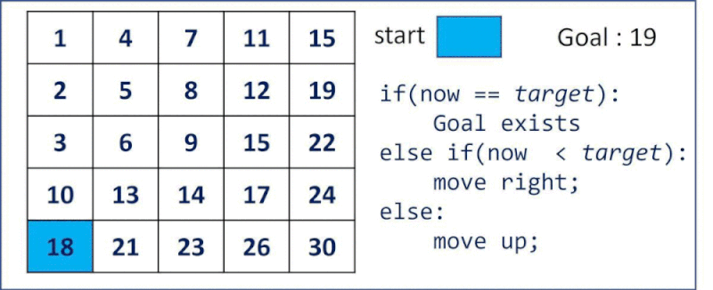

# 劍指 Offer 04 二維數組中的查找

在一個 n * m 的二維數組中，每一行都按照從左到右遞增的順序排序，每一列都按照從上到下遞增的順序排序。
請完成一個高效的函數，輸入這樣的一個二維數組和一個整數，判斷數組中是否含有該整數。

[LeetCode](https://leetcode-cn.com/problems/er-wei-shu-zu-zhong-de-cha-zhao-lcof/)

### Example

現有矩陣matrix如下：
```
[
  [1,   4,  7, 11, 15],
  [2,   5,  8, 12, 19],
  [3,   6,  9, 16, 22],
  [10, 13, 14, 17, 24],
  [18, 21, 23, 26, 30]
]
```
給定 target = 5，返回 `true`   
給定 target = 20 返回 `false`

### 限制
* 0 <= n <= 1000
* 0 <= m <= 1000

## Solution  

### C++


* 時間覆雜度：o(n + m)
  時間覆雜度：O(n+m)O(n+m)。訪問到的下標的行最多增加 n 次，列最多減少 m 次，因此循環體最多執行
* 空間覆雜度：o(1)

```
class Solution
{
public:
    bool findNumberIn2DArray(vector<vector<int>> &matrix, int target)
    {
        int rowLen = matrix.size();

        if(rowLen == 0)
            return false;

        int colLen = matrix[0].size();        

        /** set starting point to be bottom left point*/
        int row = rowLen - 1;
        int col = 0;

        while (row >= 0 && col < colLen)
        {
            int tmp = matrix[row][col];

            if(tmp == target)
                return true;
            else if(tmp < target)
                ++col;
            else 
                --row;            
        }

        return false;
    }
};

int main()
{
    /* Input */
    vector<vector<int>> input = {{1, 4, 7, 11, 15},
                                 {2, 5, 8, 12, 19},
                                 {3, 6, 9, 16, 22},
                                 {10, 13, 14, 17, 24},
                                 {18, 21, 23, 26, 30}};
    
    /* Test*/
    Solution test;
    int res = test.findNumberIn2DArray(input, 0);

    return 0;
}
```
