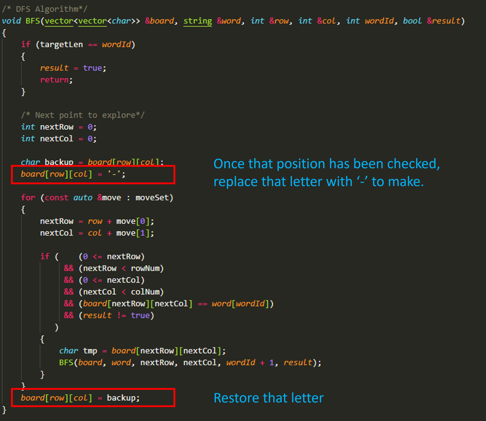

# 劍指 Offer 12 矩陣中的路徑

給定一個 m x n 二維字符網格 board 和一個字符串單詞 word 。如果 word 存在於網格中，返回 true ；否則，返回 false 。

單詞必須按照字母順序，通過相鄰的單元格內的字母構成，其中“相鄰”單元格是那些水平相鄰或垂直相鄰的單元格。同一個單元格內的字母不允許被重覆使用。
 
[LeetCode](https://leetcode-cn.com/problems/ju-zhen-zhong-de-lu-jing-lcof/)

例如，在下面的 3×4 的矩陣中包含單詞 "ABCCED"（單詞中的字母已標出）。


### Example 1
```
輸入：board = [["A","B","C","E"],["S","F","C","S"],["A","D","E","E"]], word = "ABCCED"
輸出：true
```

### Example 2
```
輸入：board = [["a","b"],["c","d"]], word = "abcd"
輸出：false
```

* 1 <= board.length <= 200
* 1 <= board[i].length <= 200
* board 和 word 僅由大小寫英文組成

## Solution  


### C++

* 時間複雜度: O(3^KMN) 最差情況下，需要遍歷矩陣中長度為 KK 字符串的所有方案，時間複雜度為 O(3^K);
  矩陣中共有 MN個起點，時間複雜度為 O(MN)。
  方案數計算： 設字符串長度為 K ，搜索中每個字符有上、下、左、右四個方向可以選擇，舍棄回頭（上個字符）的方向，剩下 3 種選擇，因此方案數的複雜度為 O(3^K)。

* 空間複雜度: O(K) 搜索過程中的遞歸深度不超過 K ，因此系統因函數調用累計使用的棧空間占用 O(K)（因為函數返回後，系統調用的棧空間會釋放）。
  最壞情況下 K = MN，遞歸深度為 MN ，此時系統棧使用 O(MN) 的額外空間。

```
#include <vector>
#include <string>

using namespace std;

class Solution
{
private:
    int rowNum{0};
    int colNum{0};
    int targetLen{0};
    /* move up down left right*/
    vector<vector<int>> moveSet = {{-1, 0}, {1, 0}, {0, -1}, {0, 1}};

    /* DFS Algorithm*/
    void BFS(vector<vector<char>> &board, string &word, int &row, int &col, int wordId, bool &result)
    {
        if (targetLen == wordId)
        {
            result = true;
            return;
        }

        /* Next point to explore*/
        int nextRow = 0;
        int nextCol = 0;

        char backup = board[row][col];
        board[row][col] = '-';

        for (const auto &move : moveSet)
        {
            nextRow = row + move[0];
            nextCol = col + move[1];

            if ((0 <= nextRow) && (nextRow < rowNum) && (0 <= nextCol) && (nextCol < colNum) && (board[nextRow][nextCol] == word[wordId]) && result != true)
            {
                char tmp = board[nextRow][nextCol];
                BFS(board, word, nextRow, nextCol, wordId + 1, result);
            }
        }
        board[row][col] = backup;
    }

public:
    bool exist(vector<vector<char>> &board, string word)
    {
        rowNum = board.size();
        colNum = board[0].size();
        targetLen = word.size();

        int start = word[0];

        bool ret = false;

        for (int row = 0; row < rowNum; ++row)
        {
            for (int col = 0; col < colNum; ++col)
            {
                if (board[row][col] == start && ret == false)
                    BFS(board, word, row, col, 1, ret);
                
            }
        }

        return ret;
    }
};

int main()
{
    /* Input */
    vector<vector<char>> board = {{'A', 'B', 'C', 'E'}, {'S', 'F', 'E', 'S'}, {'A', 'D', 'E', 'E'}};

    /* Test*/
    Solution test;
    bool res = test.exist(board, "ABCESEEEFS");

    return 0;
}
```
