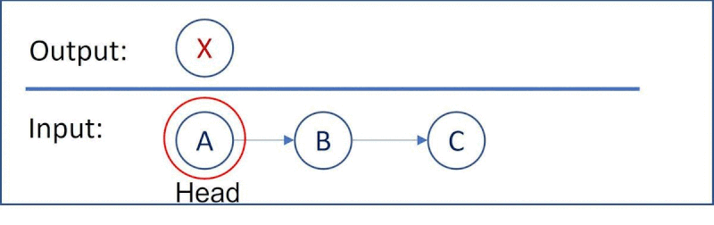

# 劍指 Offer 24 反轉鍊表

定義一個函數，輸入一個鍊表的頭節點，反轉該鍊表並輸出反轉曲鍊表的頭節點。

 
[LeetCode](https://leetcode-cn.com/problems/fan-zhuan-lian-biao-lcof/)


### Example 1

```
輸入: 1->2->3->4->5->NULL
輸出: 5->4->3->2->1->NULL
```

* 0 <= 節點個數 <= 5000


## Solution  



### C++

* 時間複雜度：O(n) 其中n是鍊表的長度，需要遍曆鍊表一次。

* 空間複雜度：O(1) 


```
struct ListNode
{
    int val;
    ListNode *next;
    ListNode(int x) : val(x), next(NULL) {}
};

class Solution
{
public:
    ListNode *reverseList(ListNode *head)
    {
        ListNode *revHead = nullptr;
        ListNode *tmpRevTail = nullptr;


        while (head != nullptr)
        {
            revHead = head;
            head = head->next;
            revHead->next= tmpRevTail; 
            tmpRevTail = revHead;            
        }

        return revHead;
    }
};

int main()
{
    /* input*/
    ListNode A(1), B(3), C(5);
    A.next = &B;
    B.next = &C;

    /* Test*/
    Solution test;
    ListNode *res = test.reverseList(&A);

    return 0;
}
```