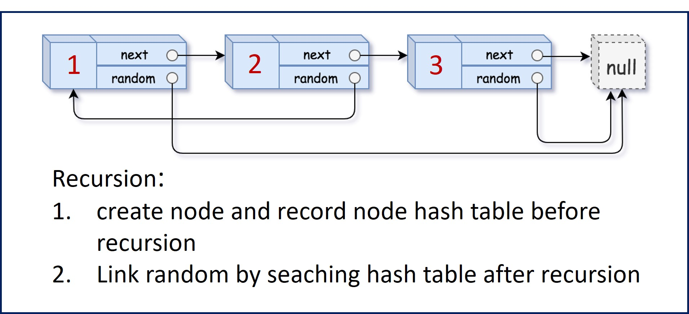

# 劍指 Offer 35 複雜鏈表的覆制

請實現 copyRandomList 函數，覆制一個複雜鏈表。在複雜鏈表中，每個節點除了有一個 next 指針指向下一個節點，
還有一個 random 指針指向鏈表中的任意節點或者 null。

[LeetCode](https://leetcode-cn.com/problems/fu-za-lian-biao-de-fu-zhi-lcof/)

### Example 1


```
輸入：head = [[7,null],[13,0],[11,4],[10,2],[1,0]]
輸出：[[7,null],[13,0],[11,4],[10,2],[1,0]]\
```

### Example 2

```
輸入：head = [[1,1],[2,1]]
輸出：[[1,1],[2,1]]
```

* 10000 <= Node.val <= 10000
* Node.random 為空（null）或指向鍊表中的節点。
* 節點數目不超過 1000 。
 
## Solution  

### C++

* 時間複雜度：O(n) 其中n是鍊表的長度，需要遍曆鍊表一次。

* 空間複雜度：O(n) 哈希表空間




```
#include <unordered_map>

using namespace std;

class Node
{
public:
    int val;
    Node *next;
    Node *random;

    Node(int _val)
    {
        val = _val;
        next = NULL;
        random = NULL;
    }
};

class Solution
{
private:
    unordered_map<Node *, Node *> hash;    

public:
    Node *copyRandomList(Node *head)
    {
        if (head == nullptr)
            return nullptr;

        Node *copyHead = new Node(head->val);

        if (hash.count(head) == 0)
            hash[head] = copyHead;

        copyHead->next = copyRandomList(head->next);

        if(hash.count(head->random) != 0 && head->random != nullptr)
            copyHead->random = hash[head->random];

        return copyHead;
    }
};

int main()
{
    /* input*/
    Node A(1), B(3), C(5);
    A.next = &B;
    B.next = &C;

    A.random = &C;
    B.random = &A;
    C.random = &B;

    /* Test*/
    Solution test;
    Node *res = test.copyRandomList(&A);

    return 0;
}
```