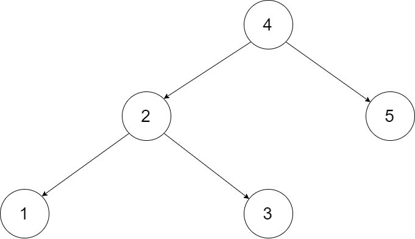

# 劍指 Offer 36 二叉搜索樹與雙向鏈表

輸入一棵二叉搜索樹，將該二叉搜索樹轉換成一個排序的循環雙向鏈表。要求不能創建任何新的節點，只能調整樹中節點指針的指向。

為了讓您更好地理解問題，以下面的二叉搜索樹為例：




我們希望將這個二叉搜索樹轉化為雙向循環鏈表。鏈表中的每個節點都有一個前驅和後繼指針。對於雙向循環鏈表，第一個節點的前驅是最後一個節點，最後一個節點的後繼是第一個節點。

下圖展示了上面的二叉搜索樹轉化成的鏈表。“head” 表示指向鏈表中有最小元素的節點。


特別地，我們希望可以就地完成轉換操作。當轉化完成以後，樹中節點的左指針需要指向前驅，樹中節點的右指針需要指向後繼。還需要返回鏈表中的第一個節點的指針。


[LeetCode](https://leetcode-cn.com/problems/er-cha-sou-suo-shu-yu-shuang-xiang-lian-biao-lcof/)

 
## Solution  

* [In-Order Traversal](https://zh.wikipedia.org/wiki/%E6%A0%91%E7%9A%84%E9%81%8D%E5%8E%86#%E4%B8%AD%E5%BA%8F%E9%81%8D%E5%8E%86(In-Order_Traversal))

### C++

* 時間複雜度：O(n) 為二叉樹的節點數，中序遍歷需要訪問所有節點。

* 空間複雜度：O(n) 最差情況下，即樹退化為鏈表時，遞歸深度達到 N，系統使用 O(N) 棧空間。


```
class Node
{
public:
    int val;
    Node *left;
    Node *right;

    Node() {}

    Node(int _val)
    {
        val = _val;
        left = NULL;
        right = NULL;
    }

    Node(int _val, Node *_left, Node *_right)
    {
        val = _val;
        left = _left;
        right = _right;
    }
};

class Solution
{
private:
    Node *prev{nullptr};
    Node *curr{nullptr};

    Node *head{nullptr};
    Node *tail{nullptr};

    void recursion(Node *root)
    {
        if (root == nullptr)
            return;

        /*search left branch*/
        recursion(root->left);
        /* do sth here */
        prev = curr;
        curr = root;
        curr->left = prev;
        
        if (prev != nullptr)
            prev->right = curr;
          
        if (prev == nullptr && curr != nullptr)
            head = curr;
        /* Tail updates every time the root expand*/
        tail = curr;

        recursion(root->right);
    }

public:
    Node *treeToDoublyList(Node *root)
    {
        if (root != nullptr)
        {
            recursion(root);
            head->left = tail;
            tail->right = head;
        }

        return head;
    }
};

int main()
{
    /* input*/
    Node A(1), B(2), C(3), D(4);
    B.left = &A;
    B.right = &C;
    D.left = &B;

    

    /* Test*/
    Solution test;

    Node *res = test.treeToDoublyList(&D);

    return 0;
}
```