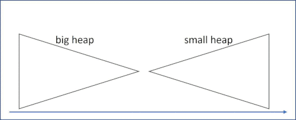

# 劍指 Offer 41 數據流中的中位數

如何得到一個數據流中的中位數？如果從數據流中讀出奇數個數值，那麽中位數就是所有數值排序之後位於中間的數值。如果從數據流中讀出偶數個數值，那麽中位數就是所有數值排序之後中間兩個數的平均值。

例如:

[2,3,4] 的中位數是 3

[2,3] 的中位數是 (2 + 3) / 2 = 2.5

設計一個支持以下兩種操作的數據結構：

* void addNum(int num) - 從數據流中添加一個整數到數據結構中。
* double findMedian() - 返回目前所有元素的中位數。

[LeetCode](https://leetcode-cn.com/problems/shu-ju-liu-zhong-de-zhong-wei-shu-lcof/)

### Example 1

```
輸入：["MedianFinder","addNum","addNum","findMedian","addNum","findMedian"]
[[],[1],[2],[],[3],[]]
輸出：[null,null,null,1.50000,null,2.00000]
```

### Example 2

```
輸入：["MedianFinder","addNum","findMedian","addNum","findMedian"]
[[],[2],[],[3],[]]
輸出：[null,null,2.00000,null,2.50000]
```

* 最多會對 addNum、findMedian 進行 50000 次調用。
 
## Solution  

### C++

* 時間複雜度:
  查找中位数 O(1) ： 獲取堆頂元素使用 O(1) 时间；
  添加数字 O(log N) ： 堆的插入和彈出操作使用 O(log N) 时间

* 空間複雜度 (N) ： 其中 N 為數據流中的元素數量，小頂堆和大頂堆最多同時保存 N 個元素。




```
#include <queue>

using namespace std;

class MedianFinder
{
private:
    priority_queue<int, vector<int>, less<int>> bigHeap;
    priority_queue<int, vector<int>, greater<int>> smallHeap;
    bool even{true};

public:
    /** initialize your data structure here. */
    MedianFinder()
    {
    }

    void addNum(int num)
    {
        bigHeap.push(num);
        smallHeap.push(bigHeap.top());
        bigHeap.pop();

        even = even == true ? false : true;
        if (even == true)
        {
            bigHeap.push(smallHeap.top());
            smallHeap.pop();
        }
    }

    double findMedian()
    {
        if(even != true)
            return static_cast<double>(smallHeap.top());
        else
            return static_cast<double>(smallHeap.top()+bigHeap.top())/2.0;       
    }
};

int main()
{
    /* input*/

    /* Test*/
    MedianFinder test;
    test.addNum(5);
    test.addNum(2);

    double rest = test.findMedian();

    return 0;
}
```