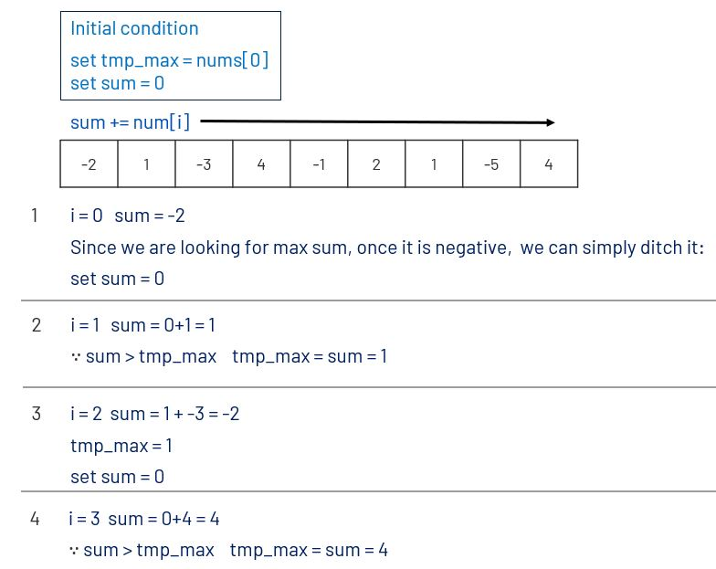

# 劍指 Offer 連續子數組的最大和
輸入一個整型數組，數組中的一個或連續多個整數組成一個子數組。求所有子數組的和的最大值。

要求時間覆雜度為O(n)。


[LeetCode](https://leetcode-cn.com/problems/lian-xu-zi-shu-zu-de-zui-da-he-lcof/)

### Example 1

```
輸入: nums = [-2,1,-3,4,-1,2,1,-5,4]
輸出: 6
解釋: 連續子數組 [4,-1,2,1] 的和最大，為 6。
```

* 1 <= arr.length <= 10^5
* -100 <= arr[i] <= 100

 
## Solution  



### C++

* 時間複雜度：O(n) 其中n為長度，需要遍曆一次。

* 空間複雜度：O(1) 


```
#include <vector>
#include <climits>

using namespace std;

class Solution
{
public:
    int maxSubArray(vector<int> &nums)
    {
        int sum = 0;
        int max = INT_MIN;
        for (const auto &tmp : nums)
        {
            sum += tmp;            
            max = sum > max? sum:max;
            if( sum < 0)
                sum = 0;
        }
        return max;
    }
};

int main()
{
    /* input*/
    vector<int> nums = {-2,1};
    /* Test*/
    Solution test;

    int res = test.maxSubArray(nums);

    return 0;
}
```