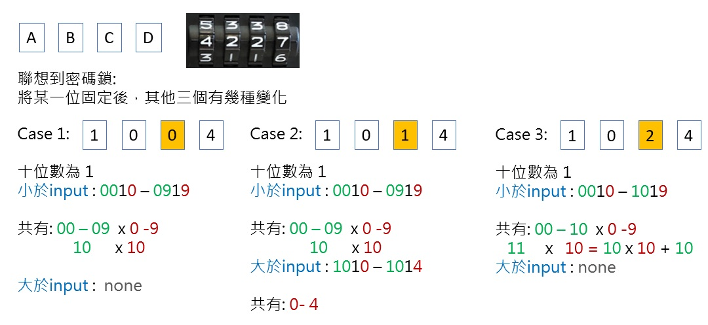

# 劍指 Offer 51 數組中的逆序對

在數組中的兩個數字，如果前面一個數字大於後面的數字，則這兩個數字組成一個逆序對。輸入一個數組，求出這個數組中的逆序對的總數。

### Example 1
```
輸入: [7,5,6,4]
輸出: 5
```

* 0 <= 數組長度 <= 50000

[LeetCode](https://leetcode-cn.com/problems/shu-zu-zhong-de-ni-xu-dui-lcof/)

## Solution  



### C++

* 時間複雜度：(nlogn )  由於歸並排序每次都將當前待排序的序列折半成兩個子序列遞歸調用，然後再合並兩個有序的子序列，
                       而每次合並兩個有序的子序列需要O(n) 的時間覆雜度，所以我們可以列出歸並排序運行時間 T(n) 的遞歸表達式：
                       T(n)=2T(2/n)+O(n) 根據主定理我們可以得出歸並排序的時間覆雜度為 O(nlog n)。

* 空間複雜度：O(n)      我們需要額外O(n) 空間的 tmp 數組，且歸並排序遞歸調用的層數最深為 log  n，所以我們還需要額外的O(log n) 的棧空間
                       所需的空間覆雜度即為 O(n+log n)=O(n)。
```
#include <vector>

using namespace std;

class Solution
{
private:
    vector<int> tmp;
    int count{0};
    void mergeSort(vector<int> &nums, int left, int right)
    {
        int len = right - left + 1;
        if (len == 1)
            return;

        int mid = left + (right - left) / 2;

        /* split the vector into two groups*/
        mergeSort(nums, left, mid);
        mergeSort(nums, mid + 1, right);

        int leftStart = left;
        int rightStart = mid + 1;
        int tmpStart = left;

        while (leftStart <= mid && rightStart <= right)
        {
            if (nums[leftStart] <= nums[rightStart])
                tmp[tmpStart++] = nums[leftStart++];
            else
            {
                count += mid - leftStart + 1;
                tmp[tmpStart++] = nums[rightStart++];
            }
        }

        while (leftStart <= mid)
            tmp[tmpStart++] = nums[leftStart++];

        while (rightStart <= right)
            tmp[tmpStart++] = nums[rightStart++];

        tmpStart = left;

        while (left <= right)
        {
            nums[left] = tmp[left];
            left++;
        }
    }

public:
    int reversePairs(vector<int> &nums)
    {
        /* use merge sort to count the reverse pairs*/
        int len = nums.size();
        if (len <= 1)
            return 0;

        tmp.resize(len);
        mergeSort(nums, 0, len - 1);

        return count;
    }
};

int main()
{
    /* input*/
    vector<int> input = {7, 5, 6, 4};

    /* Test*/
    Solution test;
    int res = test.reversePairs(input);

    return 0;
}

```