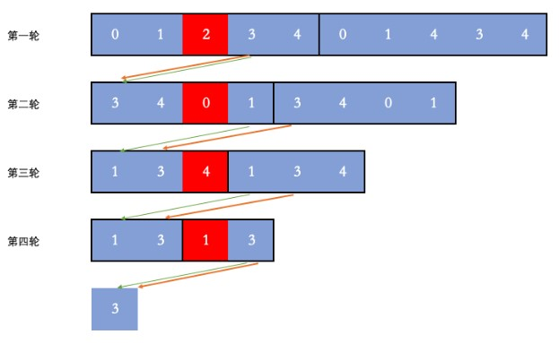

# 劍指 Offer 62 圓圈中最後剩下的數字

0,1,···,n-1這n個數字排成一個圓圈，從數字0開始，每次從這個圓圈里刪除第m個數字（刪除後從下一個數字開始計數）。求出這個圓圈里剩下的最後一個數字。

例如，0、1、2、3、4這5個數字組成一個圓圈，從數字0開始每次刪除第3個數字，則刪除的前4個數字依次是2、0、4、1，因此最後剩下的數字是3。

[LeetCode](https://leetcode-cn.com/problems/yuan-quan-zhong-zui-hou-sheng-xia-de-shu-zi-lcof/)

### Example 1
```
輸入: n = 5, m = 3
輸出: 3
```

### Example 2
```
輸入: n = 10, m = 17
輸出: 2
``` 

* 1 <= n <= 10^5
* 1 <= m <= 10^6


## Solution  



### C++

* 時間複雜度：O(n) : n 數字

* 空間複雜度：O(1) 除了答案數組只需要常數的空間存放若幹變量

```
class Solution
{
public:
    int lastRemaining(int n, int m)
    {
        /* we could use a for loop to calculate the position in length = N
           list, base on the position already know from length = N-1*/

        /* we want to know in length = 1, the last one
         * also the first one*/
        int position = 0;
        for (int len = 2; len <= n; ++len)
        {
            position = (position + m )%len;
        }

        return position;
    }
};

int main()
{
    /* input*/

    /* Test*/
    Solution test;
    bool res = test.lastRemaining(5,3);

    return 0;
}
```