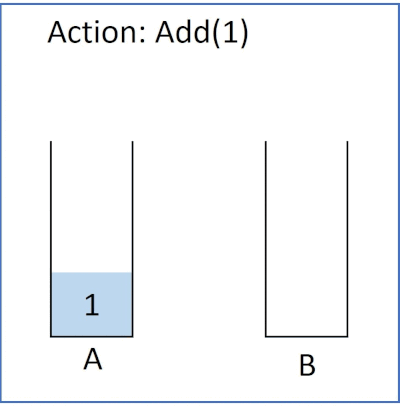

# 劍指 Offer 09. 用兩個棧實現隊列
用兩個棧實現一個隊列。隊列的聲明如下，請實現它的兩個函數 appendTail 和 deleteHead ，分別完成在隊列尾部插入整數和在隊列頭部刪除整數的功能。
(若隊列中沒有元素，deleteHead 操作返回 -1 )

用两个栈实现一个队列。队列的声明如下，请实现它的两个函数 appendTail 和 deleteHead ，分别完成在队列尾部插入整数和在队列头部删除整数的功能。(若队列中没有元素，deleteHead 操作返回 -1 )

[LeetCode](https://leetcode-cn.com/problems/yong-liang-ge-zhan-shi-xian-dui-lie-lcof)

## Solution  

### C++
* stack



* 時間複雜度：對於插入和刪除操作，時間複雜度均為 O(1)O(1)。插入不多說，對於刪除操作，雖然看起來是 O(n)O(n) 的時間複雜度，但是仔細考慮下每個元素只會「至多被插入和彈出 stack2 一次」，因此均攤下來每個元素被刪除的時間複雜度仍為 O(1)O(1)。

* 空間複雜度：O(n)O(n)。需要使用兩個棧存儲已有的元素。
```
#include <stack>

using namespace std;

class CQueue
{
private:
    stack<int> output;
    stack<int> add;

public:
    CQueue(){};

    void appendTail(int value)
    {
        add.push(value);
    }

    int deleteHead()
    {
        
        if (output.empty() == true)
        {
            while (add.empty() != true)
            {
                output.push(add.top());
                add.pop();
            }
        }

        if(output.empty() == true)
            return -1;

        int tmp = output.top();
        output.pop();

        return tmp;
    }
};

int main()
{
    /**
     * Your CQueue object will be instantiated and called as such:
     */
    CQueue *obj = new CQueue();
    int a = obj->deleteHead();
    obj->appendTail(1);
    obj->appendTail(2);
    int b = obj->deleteHead();
    obj->appendTail(3);
    int c = obj->deleteHead();

    return 0;
}
```

* sort stack when add()

```
#include <stack>

using namespace std;

class CQueue
{
private:
    stack<int> output;
    stack<int> add;

public:
    CQueue(){};

    void appendTail(int value)
    {
        int tmp = 0;
        while (output.empty() != true)
        {
            tmp = output.top();
            output.pop();
            add.push(tmp);
        }

        output.push(value);

        while (add.empty() != true)
        {
            tmp = add.top();
            add.pop();
            output.push(tmp);
        }
    }

    int deleteHead()
    {
        if (output.empty() == true)
            return -1;
        
        int tmp = 0;
        tmp = output.top();
        output.pop();

        return tmp;
    }
};


int main()
{
    /**
     * Your CQueue object will be instantiated and called as such:
     */
    CQueue *obj = new CQueue();
    int a = obj->deleteHead();
    obj->appendTail(5);
    obj->appendTail(2);
    int b = obj->deleteHead();
    int c = obj->deleteHead();

    return 0;
}
```