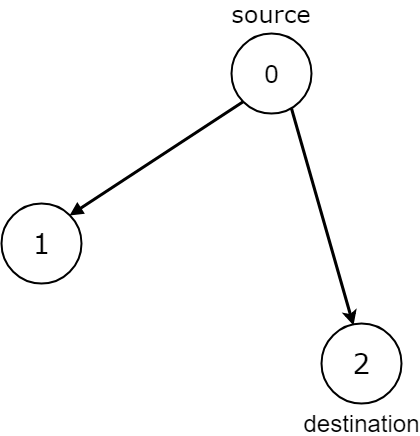
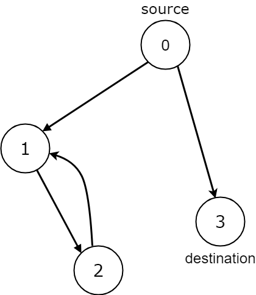

# 1059 從始點到終點的所有路徑

給定有向圖的邊 edges，以及該圖的始點 source 和目標終點 destination，確定從始點 source 出發的所有路徑是否最終結束於目標終點 destination，即：

* 從始點 source 到目標終點 destination 存在至少一條路徑
* 如果存在從始點 source 到沒有出邊的節點的路徑，則該節點就是路徑終點。
* 從始點source到目標終點 destination 可能路徑數是有限數字
當從始點 source 出發的所有路徑都可以到達目標終點 destination 時返回 true，否則返回 false。

## All Paths from Source Lead to Destination

Given the edges of a directed graph where edges[i] = [ai, bi] indicates there is an edge between nodes ai and bi, and two nodes source and destination of this graph, determine whether or not all paths starting from source eventually, end at destination, that is:

* At least one path exists from the source node to the destination node
* If a path exists from the source node to a node with no outgoing edges, then that node is equal to destination.
* The number of possible paths from source to destination is a finite number.
Return true if and only if all roads from source lead to destination.

[LeetCode](https://leetcode-cn.com/all-paths-from-source-lead-to-destination/)

### Example 1



```
Input: n = 3, edges = [[0,1],[0,2]], source = 0, destination = 2
Output: false
Explanation: It is possible to reach and get stuck on both node 1 and node 2.
```

### Example 2



```
Input: n = 4, edges = [[0,1],[0,3],[1,2],[2,1]], source = 0, destination = 3
Output: false
Explanation: We have two possibilities: to end at node 3, or to loop over node 1 and node 2 indefinitely.
```

### Example 3


```
Input: n = 4, edges = [[0,1],[0,2],[1,3],[2,3]], source = 0, destination = 3
Output: true
```

### Example 4


```
Input: n = 3, edges = [[0,1],[1,1],[1,2]], source = 0, destination = 2
Output: false
Explanation: All paths from the source node end at the destination node, but there are an infinite number of paths, such as 0-1-2, 0-1-1-2, 0-1-1-1-2, 0-1-1-1-1-2, and so on.
```

### C++ 


```
class Solution {
public:
    bool leadsToDestination(int n, vector<vector<int>>& edges, int source, int destination) {
        //由終點出發，確認是否可到達出發點
        vector<int> count(n,0);
        unordered_map<int, vector<int>> path;
        for(const vector<int> edge : edges)
        {
            path[edge[1]].push_back(edge[0]);
            ++count[edge[0]];
        }
        // destination是否入度為 0
        if(count[destination] != 0)
            return false;
        
        queue<int> frontier;
        frontier.push(destination);

        while(frontier.empty() != true)
        {
            int temp = frontier.front();
            frontier.pop();

            if(temp == source)
                return true;

            for(const int& next : path[temp])
            {
                if(--count[next] == 0)
                    frontier.push(next);
            }
        }

        return false;
    }
};
```
