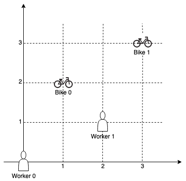

# 1066 校園自行車分配 II

在由 2D 網格表示的校園里有 n 位工人（worker）和 m 輛自行車（bike），n <= m。所有工人和自行車的位置都用網格上的 2D 坐標表示。

我們為每一位工人分配一輛專屬自行車，使每個工人與其分配到的自行車之間的 曼哈頓距離 最小化。

返回 每個工人與分配到的自行車之間的曼哈頓距離的最小可能總和 。

p1 和 p2 之間的 曼哈頓距離 為 Manhattan(p1, p2) = |p1.x - p2.x| + |p1.y - p2.y|。


## Campus Bikes II

On a campus represented as a 2D grid, there are n workers and m bikes, with n <= m. Each worker and bike is a 2D coordinate on this grid.

We assign one unique bike to each worker so that the sum of the Manhattan distances between each worker and their assigned bike is minimized.

Return the minimum possible sum of Manhattan distances between each worker and their assigned bike.

The Manhattan distance between two points p1 and p2 is Manhattan(p1, p2) = |p1.x - p2.x| + |p1.y - p2.y|.

### Constraints

* n == workers.length
* m == bikes.length
* 1 <= n <= m <= 10
* workers[i].length == 2
* bikes[i].length == 2
* 0 <= workers[i][0], workers[i][1], bikes[i][0], bikes[i][1] < 1000
* All the workers and the bikes locations are unique.

[LeetCode](https://leetcode-cn.com/problems/campus-bikes-ii/)


### Example 1



```
Input: workers = [[0,0],[2,1]], bikes = [[1,2],[3,3]]
Output: 6
Explanation: 
We assign bike 0 to worker 0, bike 1 to worker 1. The Manhattan distance of both assignments is 3, so the output is 6.
```

### Example 2


```
Input: workers = [[0,0],[1,1],[2,0]], bikes = [[1,0],[2,2],[2,1]]
Output: 4
Explanation: 
We first assign bike 0 to worker 0, then assign bike 1 to worker 1 or worker 2, bike 2 to worker 2 or worker 1. Both assignments lead to sum of the Manhattan distances as 4.
```

### C++ 

#### DFS + 記憶化
```
class Solution {
private:
    int wLen{0};
    int bLen{0};
    vector<vector<int>> dist;
    unordered_map<uint16_t, int> record;
    uint16_t visted{0};
public:
    int assignBikes(vector<vector<int>>& workers, vector<vector<int>>& bikes) {
        /* DFS + 記憶化
           假設   b1  b2  b3  b4  每一個bike只能用一次
              w1  2   4   6   8
              w2  1   3   5   7
              w3  8   6   4   2
              w4  7   5   3   1
           若b1 跟 b2被分配了給了w1跟w2不論哪種方式
                  b1  b2  b3  b4   或是     b1  b2  b3  b4
              w1  -   4   6   8         w1  2   -   6   8
              w2  1   -   5   7         w2  -   3   5   7
              w3  8   6   4   2         w3  8   6   4   2
              w4  7   5   3   1         w4  7   5   3   1
              都會接下來排列w3 跟w4的所有組合，找出最小的合， w3 = 2 w4 = 1
              而這一部其實是重覆的記算了，可以記下當 bike被使用掉的情形下
              所得到的值，當下一次又出現同樣被使用掉的bike狀況，直接取值，就不用再計算了

              要注意的點是我們要使用postOrder，並在每一層記下其最小的值            
        */
        wLen = workers.size();
        bLen = bikes.size();

        //計算每一個worker到每一個bike的值
        dist.resize(wLen, vector<int>(bLen,0));
        for(int i = 0; i < wLen; ++i)
        {
            for(int j = 0; j < bLen; ++j)
                dist[i][j] = abs(workers[i][0] - bikes[j][0]) + abs(workers[i][1] - bikes[j][1]);
        }
        int level = 0;

        int minSum = dfs(0);
        return minSum;
    }

    int dfs(const int&& worker)
    {
        if(worker >= wLen)
            return 0;
        int minSum = INT_MAX;

        if(record.find(visted) != record.end())
            return record[visted];
        for(int bike = 0; bike < bLen; ++bike)
        {
            //計算這個bike是否已經被分配了
            if((visted & 1 << bike) == 0)
            {
                visted ^= (1 << bike);
                int&& sum = dist[worker][bike] + dfs(worker + 1);
                minSum = min(minSum, sum);
                visted ^= (1 << bike);
            }
        }
        record[visted] = minSum;
        return minSum;
    }
};
```


#### DFS + 分支
```
class Solution {
private:
    vector<vector<int>> dist;
    vector<bool> visted;
    int wLen{0};
    int bLen{0};
    int minSum{INT_MAX};
    void dfs(const int& workerNum, int& sum)
    {
        //終止條件:全部worker都跑遍了
        if(workerNum >= wLen)
        {    
            minSum = min(minSum, sum);
            return;
        }

        //從bikes中選一個為這一次的
        for(int bike = 0; bike < bLen; ++bike)
        {
            if(visted[bike] == true)
                continue;
            
            visted[bike] = true;
            sum += dist[workerNum][bike];
            if(sum <= minSum)
                dfs(workerNum + 1, sum);
            visted[bike] = false;
            sum -= dist[workerNum][bike];
        }

    }
public:
    int assignBikes(vector<vector<int>>& workers, vector<vector<int>>& bikes) {
        /* DFS
        將bike距各worker的距離計算並儲存如
              b0   b1
          w0  3    6
          w1  2    3
          從第一層開始，遍歷所有的可能性 
        */
        wLen = workers.size();
        bLen = bikes.size();
        dist.resize(wLen, vector<int>(bLen, 0));
        visted.resize(bLen, false);
        //儲存worker到每一個bike的距離
        for(int worker = 0; worker < wLen; ++worker){
            for(int bike = 0; bike < bLen; ++bike){
                int&& tempDist = abs(workers[worker][0] - bikes[bike][0]) + abs(workers[worker][1] - bikes[bike][1]);
                dist[worker][bike] = move(tempDist); 
            }
        }
        
        int sum = 0;
        dfs(0, sum);

        return minSum;
    }
};
```
