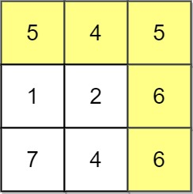
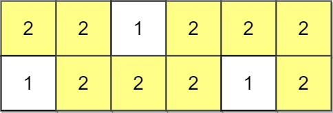
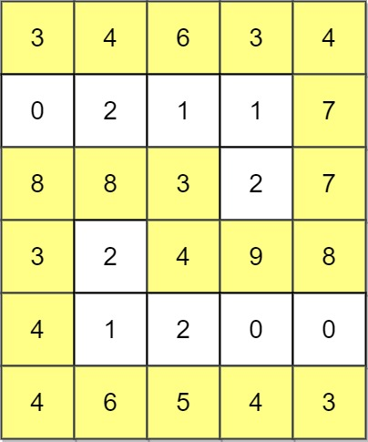

# 1102 得分最高的路徑

給你一個 R 行 C 列的整數矩陣 A。矩陣上的路徑從 [0,0] 開始，在 [R-1,C-1] 結束。

路徑沿四個基本方向（上、下、左、右）展開，從一個已訪問單元格移動到任一相鄰的未訪問單元格。

路徑的得分是該路徑上的 最小 值。例如，路徑 8 →  4 →  5 →  9 的值為 4 。

找出所有路徑中得分 最高 的那條路徑，返回其 得分。

## Path With Maximum Minimum Value

Given an m x n integer matrix grid, return the maximum score of a path starting at (0, 0) and ending at (m - 1, n - 1) moving in the 4 cardinal directions.

The score of a path is the minimum value in that path.

For example, the score of the path 8 → 4 → 5 → 9 is 4.

### Constraints

* m == grid.length
* n == grid[i].length
* 1 <= m, n <= 100
* 0 <= grid[i][j] <= 10<sup>9</sup>


[LeetCode](https://leetcode-cn.com/problems/path-with-maximum-minimum-value/)


### Example 1



```
Input: grid = [[5,4,5],[1,2,6],[7,4,6]]
Output: 4
Explanation: The path with the maximum score is highlighted in yellow.
```

### Example 2



```
Input: grid = [[2,2,1,2,2,2],[1,2,2,2,1,2]]
Output: 2
```

### Example 3



```
Input: grid = [[3,4,6,3,4],[0,2,1,1,7],[8,8,3,2,7],[3,2,4,9,8],[4,1,2,0,0],[4,6,5,4,3]]
Output: 3
```

### C++ 

```
class Solution {
private:
    vector<vector<int>> dpSpace;
    vector<vector<int>> moves{{-1,0},{1,0},{0,-1},{0,1}}; //上下左右

public:
    int maximumMinimumPath(vector<vector<int>>& grid) {
        /*  動態規劃
            建立一同樣大小的矩陣dpSpace，預設值為 0
            起始點的值同為grid的值，若至下一個可能的點，其值比該位置的dpSpace值大
            則將其加入queue, 重覆過程直到queue長度為 0
        */
        int&& rowNum = grid.size();
        int&& colNum = grid[0].size();
        dpSpace.resize(rowNum, vector<int>(colNum, 0));
        dpSpace[0][0] = grid[0][0];

        //擴展的隊列初始化
        priority_queue<vector<int>, vector<vector<int>> > frontier;
        frontier.push({grid[0][0],0,0});

        while(frontier.empty() != true)
        {
            vector<int>temp = frontier.top();
            frontier.pop();
            grid[temp[1]][temp[2]] = -1;

            for(const vector<int>& move : moves)
            {
                int&& nextRow = temp[1] + move[0];
                int&& nextCol = temp[2] + move[1];
                if(nextRow >= 0 && nextRow < rowNum && nextCol >= 0 && nextCol < colNum && grid[nextRow][nextCol] != -1)
                {
                    const int& val = min(dpSpace[temp[1]][temp[2]], grid[nextRow][nextCol]);
                    if(val > dpSpace[nextRow][nextCol])
                    {
                        dpSpace[nextRow][nextCol] = val;
                        frontier.push({val,nextRow, nextCol});
                        if(nextRow == rowNum - 1 && nextCol == colNum - 1)
                            return val;
                            
                    }
                }
            }
        }

        return dpSpace[rowNum - 1][colNum - 1];
    }
};
```


