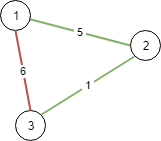

# 1135 最低成本聯通所有城市

想象一下你是個城市基建規劃者，地圖上有 N 座城市，它們按以 1 到 N 的次序編號。

給你一些可連接的選項 conections，其中每個選項 conections[i] = [city1, city2, cost] 表示將城市 city1 和城市 city2 連接所要的成本。
（連接是雙向的，也就是說城市 city1 和城市 city2 相連也同樣意味著城市 city2 和城市 city1 相連）。

返回使得每對城市間都存在將它們連接在一起的連通路徑（可能長度為 1 的）最小成本。
該最小成本應該是所用全部連接代價的綜合。如果根據已知條件無法完成該項任務，則請你返回 -1。

## Path With Maximum Minimum Value

There are n cities labeled from 1 to n. You are given the integer n and an array connections where connections[i] = [xi, yi, costi] indicates that the cost of connecting city xi and city yi (bidirectional connection) is costi.

Return the minimum cost to connect all the n cities such that there is at least one path between each pair of cities.
If it is impossible to connect all the n cities, return -1,

The cost is the sum of the connections' costs used.

### Constraints

* 1 <= n <= 10<sup>4</sup>
* 1 <= connections.length <= 10<sup>4</sup>
* connections[i].length == 3
* 1 <= xi, yi <= n
* xi != yi
* 0 <= costi <= 10<sup>5</sup>

[LeetCode](https://leetcode-cn.com/problems/connecting-cities-with-minimum-cost/)


### Example 1



```
Input: n = 3, connections = [[1,2,5],[1,3,6],[2,3,1]]
Output: 6
Explanation: Choosing any 2 edges will connect all cities so we choose the minimum 2.
```

### Example 2


```
Input: n = 4, connections = [[1,2,3],[3,4,4]]
Output: -1
Explanation: There is no way to connect all cities even if all edges are used.
```

### C++ 

```
class Solution {
private:
    vector<int> link;
    int count{0};
    int totalCost{0};
    static bool cmp(const vector<int>& lhs, const vector<int>& rhs )
    {
        return lhs[2] < rhs[2];
    }

    int unionFind(const int& a)
    {
        if(link[a] != a)
            link[a] = unionFind(link[a]);
        return link[a];
    }

    void unionSet(int a, int b, const int& cost)
    {
        a = unionFind(a);
        b = unionFind(b);

        if(a == b)
            return;
        
        if(a > b)
            swap(a,b);
        link[b] = a;
        --count;
        totalCost += cost;
    }
public:
    int minimumCost(int n, vector<vector<int>>& connections) {
        /*  並查集 貪心算法
            1. 若要所有的城市都聯在一起，connections.size() 至少為n - 1
               一開始設立 count = n，代表有n個獨立的城市
            2. 對connection排序，依cost由小排到大
            3. 聯結connections中的城市，若成功建立(也就是這兩個城市間無法聯結)
               count--, 並計入cost
            4. 當count == 1時，輸出cost
        */
        int&& len = connections.size();
        if(len < n - 1)
            return -1;
        count = n;
        /*建立並查集的table，因為題目中的城市編號為從1開始，table的長度為n + 1
          第一個不使用*/
        link.resize(n + 1);
        std::iota(link.begin(), link.end(), 0);

        std::sort(connections.begin(), connections.end(), cmp);
        for(const vector<int>& connection : connections)
        {
            unionSet(connection[0], connection[1], connection[2]);
            if(count == 1)
                return totalCost;
        }

        return -1; 
    }
};
```


