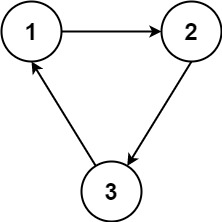

# 1136 平行課程

已知有 N 門課程，它們以 1 到 N 進行編號。

給你一份課程關系表 relations[i] = [X, Y]，用以表示課程 X 和課程 Y 之間的先修關系：課程 X 必須在課程 Y 之前修完。

假設在一個學期里，你可以學習任何數量的課程，但前提是你已經學習了將要學習的這些課程的所有先修課程。

請你返回學完全部課程所需的最少學期數。

如果沒有辦法做到學完全部這些課程的話，就返回 -1。

## Parallel Courses

You are given an integer n, which indicates that there are n courses labeled from 1 to n. You are also given an array relations where relations[i] = [prevCoursei, nextCoursei], representing a prerequisite relationship between course prevCoursei and course nextCoursei: course prevCoursei has to be taken before course nextCoursei.

In one semester, you can take any number of courses as long as you have taken all the prerequisites in the previous semester for the courses you are taking.

Return the minimum number of semesters needed to take all courses. If there is no way to take all the courses, return -1.


### Constraints

* 1 <= n <= 5000
* 1 <= relations.length <= 5000
* relations[i].length == 2
* 1 <= prevCoursei, nextCoursei <= n
* prevCourse<sub>i</sub> != nextCourse<sub>i</sub>
* All the pairs [prevCourse<sub>i</sub> , nextCourse<sub>i</sub> ] are unique.

[LeetCode](https://leetcode-cn.com/problems/parallel-courses/)


### Example 1


```
Input: n = 3, relations = [[1,3],[2,3]]
Output: 2
Explanation: The figure above represents the given graph.
In the first semester, you can take courses 1 and 2.
In the second semester, you can take course 3.
```

### Example 2



```
Input: n = 3, relations = [[1,2],[2,3],[3,1]]
Output: -1
Explanation: No course can be studied because they are prerequisites of each other.
```

### C++ 

```
class Solution {
public:
    int minimumSemesters(int n, vector<vector<int>>& relations) {
        /* 拓撲排序
           1.首先遍歷所有的relations並統計每一個課程所要先修的數目，並以unordered_map建立關系
           2.將先修的數目為0的放入queue，使用bfs遍歷該層，並紀錄層數
           3.當n的先修數目為0時，返回層數 或當queue的長度為0時，反回-1
        */
        //統計先修數目及建立關系
        vector<int> inDegree(n + 1);  // n + 1僅是為了方便N門課程從1到N編號
        vector<vector<int>> links(n + 1);

        for(const auto& relation : relations)
        {    
            ++inDegree[relation[1]]; //統計先修的數目
            links[relation[0]].push_back(relation[1]);
        }
        //將先修數目為0者放入queue
        queue<int> course;
        for(int i = 1; i <= n; ++i)
        {
            if(inDegree[i] == 0)
                course.push(i);
        } 

        int layer = 1;
        while(course.empty() != true)
        {
            int&& len = course.size();
            for(int i = 0; i < len; ++i)
            {
                int tempCourse = course.front();
                course.pop();
                if(--n == 0)
                    return layer;
                for(const int& next : links[tempCourse])
                {
                    if(--inDegree[next] == 0)
                        course.push(next);
                }
            }
            ++layer;
        }           

        return -1;
    }
};
```


