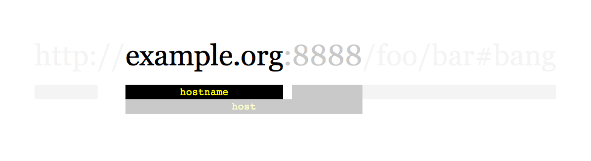

# 1236 網路爬蟲

給定一個鏈接 startUrl 和一個接口 HtmlParser ，請你實現一個網絡爬蟲，以實現爬取同 startUrl 擁有相同 域名標簽 的全部鏈接。該爬蟲得到的全部鏈接可以 任何順序 返回結果。

你的網絡爬蟲應當按照如下模式工作：

自鏈接 startUrl 開始爬取
調用 HtmlParser.getUrls(url) 來獲得鏈接url頁面中的全部鏈接
同一個鏈接最多只爬取一次
只輸出 域名 與 startUrl 相同 的鏈接集合



如上所示的一個鏈接，其域名為 example.org。簡單起見，你可以假設所有的鏈接都采用 http協議 並沒有指定 端口。
例如，鏈接 http://leetcode.com/problems 和 http://leetcode.com/contest 是同一個域名下的，而鏈接http://example.org/test 和 http://example.com/abc 是不在同一域名下的。

HtmlParser 接口定義如下： 
```
interface HtmlParser {
  // 返回給定 url 對應的頁面中的全部 url 。
  public List<String> getUrls(String url);
}
```
下面是兩個實例，用以解釋該問題的設計功能，對於自定義測試，你可以使用三個變量  urls, edges 和 startUrl。
注意在代碼實現中，你只可以訪問 startUrl ，而 urls 和 edges 不可以在你的代碼中被直接訪問。

[LeetCode](https://leetcode-cn.com/problems/web-crawler/)


### Example 1


```
輸入：
urls = [
  "http://news.yahoo.com",
  "http://news.yahoo.com/news",
  "http://news.yahoo.com/news/topics/",
  "http://news.google.com",
  "http://news.yahoo.com/us"
]
edges = [[2,0],[2,1],[3,2],[3,1],[0,4]]
startUrl = "http://news.yahoo.com/news/topics/"
輸出：[
  "http://news.yahoo.com",
  "http://news.yahoo.com/news",
  "http://news.yahoo.com/news/topics/",
  "http://news.yahoo.com/us"
]
```

### Example 2


```
輸入：
urls = [
  "http://news.yahoo.com",
  "http://news.yahoo.com/news",
  "http://news.yahoo.com/news/topics/",
  "http://news.google.com"
]
edges = [[0,2],[2,1],[3,2],[3,1],[3,0]]
startUrl = "http://news.google.com"
輸入：["http://news.google.com"]
解釋：startUrl 鏈接到所有其他不共享相同主機名的頁面。
```

### C++ 

#### 動態規劃

```
/**
 * // This is the HtmlParser's API interface.
 * // You should not implement it, or speculate about its implementation
 * class HtmlParser {
 *   public:
 *     vector<string> getUrls(string url);
 * };
 */

class Solution {
private:
    queue<string> urlQue;
    unordered_set<string> visted;
    string key;
    void getNext(string str, HtmlParser& htmlParser)
    {
        vector<string> urls = htmlParser.getUrls(str);
        for(auto& url : urls)
        {   
            if(url.find(key) == string::npos )
                continue;
            if(visted.find(url) == visted.end()) 
            {
                visted.insert(url);
                urlQue.push(move(url));
            }
        }
    }
public:
    vector<string> crawl(string startUrl, HtmlParser htmlParser) {
        /*
            BFS
            使用一個set紀錄已經探索過的url
        */
        //找出域名稱
        key = startUrl;
        if(startUrl.find('/', 7) != string::npos)
            key = {startUrl.begin(), startUrl.begin() + startUrl.find('/', 7)};

        visted.insert(startUrl);
        
        getNext(startUrl, htmlParser);

        while(urlQue.empty() != true)
        {
            string temp = urlQue.front();
            urlQue.pop();
            getNext(temp, htmlParser);
        } 

        vector<string> ret;
        for(const auto& url : visted)   
            ret.emplace_back(url);    

        return ret;
    }
};
```


