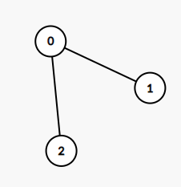
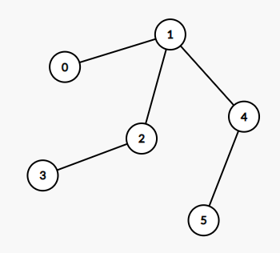

# 1245 樹的直徑

給你這棵「無向樹」，請你測算並返回它的「直徑」：這棵樹上最長簡單路徑的 邊數。

我們用一個由所有「邊」組成的數組 edges 來表示一棵無向樹，其中 edges[i] = [u, v] 表示節點 u 和 v 之間的雙向邊。

樹上的節點都已經用 {0, 1, ..., edges.length} 中的數做了標記，每個節點上的標記都是獨一無二的。

##  Tree Diameter

The diameter of a tree is the number of edges in the longest path in that tree.

There is an undirected tree of n nodes labeled from 0 to n - 1. You are given a 2D array edges where edges.length == n - 1 and edges[i] = [ai, bi] indicates that there is an undirected edge between nodes ai and bi in the tree.

Return the diameter of the tree.

### Constraints

* n == edges.length + 1
* 1 <= n <= 10<sup>4</sup>
* 0 <= ai, bi < n
* ai != bi

[LeetCode](https://leetcode-cn.com/problems/tree-diameter/)


### Example 1



```
Input: edges = [[0,1],[0,2]]
Output: 2
Explanation: The longest path of the tree is the path 1 - 0 - 2.
```

### Example 2



```
Input: edges = [[0,1],[1,2],[2,3],[1,4],[4,5]]
Output: 4
Explanation: The longest path of the tree is the path 3 - 2 - 1 - 4 - 5.
```

### C++ 

#### 後序遍歷 

```
class Solution {
private:
    unordered_map<int, vector<int>> graph;
    int maxLen{0};
    int postOrder(const int& node)
    {
        if(graph.find(node) == graph.end())
            return 1;

        //這個node的下一個可能有多個點
        priority_queue<int> priQue;
        for(const int& next : graph[node])
        {
            int&& temp = postOrder(next);
            priQue.push(temp);
        }       

        int first = priQue.top();
        priQue.pop();
        
        if(priQue.size() >= 1)            
            maxLen = max(maxLen, first + priQue.top());
        else
            maxLen = max(maxLen, first);

        return first + 1;
    }
public:
    int treeDiameter(vector<vector<int>>& edges) {
        /*
            採用後序遍曆
            1.首先要製作graph，採用unordered_map<int, vector<int>>
        */        
        if(edges.size() == 0)
            return 0;

        for(const auto& edge : edges)
        {
            int x = edge[0];
            int y = edge[1];
            if(x > y)
                swap(x,y);
            graph[edge[0]].push_back(edge[1]);
        }

        (void)postOrder(0);
        

        return maxLen;
    }
};
```


