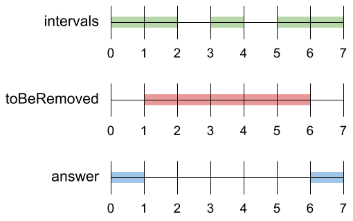
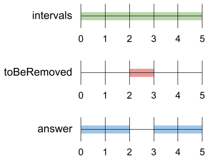

# 1272 刪除區間

實數集合可以表示為若幹不相交區間的並集，其中每個區間的形式為 [a, b)（左閉右開），表示滿足 a <= x < b 的所有實數  x 的集合。如果某個區間 [a, b) 中包含實數 x ，則稱實數 x 在集合中。

給你一個 有序的 不相交區間列表 intervals 。intervals 表示一個實數集合，其中每一項 intervals[i] = [ai, bi] 都表示一個區間 [ai, bi) 。再給你一個要刪除的區間 toBeRemoved 。

返回 一組實數，該實數表示intervals 中 刪除 了 toBeRemoved 的部分 。換句話說，返回實數集合，並滿足集合中的每個實數 x 都在 intervals 中，但不在 toBeRemoved 中。
你的答案應該是一個如上所述的 有序的 不相連的間隔列表 。

##  Remove Interval

A set of real numbers can be represented as the union of several disjoint intervals, where each interval is in the form [a, b). A real number x is in the set if one of its intervals [a, b) contains x (i.e. a <= x < b).

You are given a sorted list of disjoint intervals intervals representing a set of real numbers as described above, where intervals[i] = [ai, bi] represents the interval [ai, bi). You are also given another interval toBeRemoved.

Return the set of real numbers with the interval toBeRemoved removed from intervals. In other words, return the set of real numbers such that every x in the set is in intervals but not in toBeRemoved. Your answer should be a sorted list of disjoint intervals as described above.

### Constraints

* 1 <= intervals.length <= 10<sup>4</sup>
* -10<sup>9</sup> <= ai < bi <= 10<sup>9</sup>

[LeetCode](https://leetcode-cn.com/problems/remove-interval/)


### Example 1



```
Input: intervals = [[0,2],[3,4],[5,7]], toBeRemoved = [1,6]
Output: [[0,1],[6,7]]
```

### Example 2



```
Input: intervals = [[0,5]], toBeRemoved = [2,3]
Output: [[0,2],[3,5]]
```

### C++ 

#### Recursion

* 時間複雜度 O(N)
* 空間複雜度 O(1)

```
class Solution {
public:
    vector<vector<int>> removeInterval(vector<vector<int>>& intervals, vector<int>& toBeRemoved) {
        /*
            有幾種相互關系
            1. 不相交 - 在刪除區前面
            2. 不相交 - 在後面區後面
            3. 相交 - 刪除區佔了後半部
            4. 相交 - 刪除區佔了前半部
            5. 相交 - 刪除區被包含在中間
            6. 相交 - 刪除區包含了區間
        */
        int& rBegin = toBeRemoved[0];
        int& rEnd = toBeRemoved[1];
        vector<vector<int>> ret;
        bool behind = false;

        for(const vector<int>& interval : intervals)
        {
            if(behind == true)
            {
                ret.emplace_back(interval);
                continue;
            }
            const int& begin = interval[0];
            const int& end = interval[1];

            if(end <= rBegin) //不相交，在刪除區前面
                ret.emplace_back(interval);
            else if(rBegin < end && rBegin > begin && rEnd >= end) //相交 - 佔了後半站
                ret.push_back({begin, rBegin});
            else if(rEnd > begin && rEnd < end && rBegin <= begin) //相交 - 佔了前半站
                ret.push_back({rEnd, end});
            else if(rBegin <= begin && rEnd >= end)//相交，刪除區包含了區間
            ;
            else if(rBegin > begin && rEnd < end)  // 刪除區被包含在中間
            {    
                ret.push_back({begin, rBegin});
                ret.push_back({rEnd, end});
            }
            else if(begin >= rEnd )
            {    
                behind = true;
                ret.emplace_back(interval);
            }
        }
        return ret;
    }
};
```


