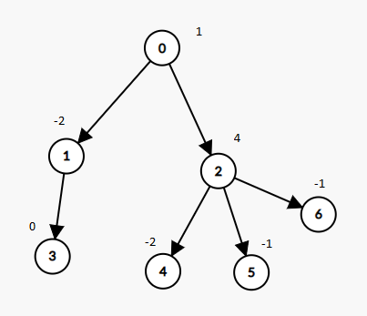

# 1273 刪除樹節點

給你一棵以節點 0 為根節點的樹，定義如下：

* 節點的總數為 nodes 個；
* 第 i 個節點的值為 value[i] ；
* 第 i 個節點的父節點是 parent[i] 。
請你刪除節點值之和為 0 的每一棵子樹。

在完成所有刪除之後，返回樹中剩余節點的數目。

##  Remove Interval

A tree rooted at node 0 is given as follows:

* The number of nodes is nodes;
* The value of the ith node is value[i];
* The parent of the ith node is parent[i].
Remove every subtree whose sum of values of nodes is zero.

Return the number of the remaining nodes in the tree.

### Constraints

* 1 <= nodes <= 10<sup>4</sup>
* parent.length == nodes
* 0 <= parent[i] <= nodes - 1
* parent[0] == -1 表示节点 0 是树的根。
* value.length == nodes
* -10<sup>5</sup> <= value[i] <= 10<sup>5</sup>


[LeetCode](https://leetcode-cn.com/problems/delete-tree-nodes/)


### Example 1



```
Input: nodes = 7, parent = [-1,0,0,1,2,2,2], value = [1,-2,4,0,-2,-1,-1]
Output: 2
```

### Example 2

```
Input: nodes = 7, parent = [-1,0,0,1,2,2,2], value = [1,-2,4,0,-2,-1,-2]
Output: 6
```

### C++ 

#### Recursion

```
class Solution {
public:
    int deleteTreeNodes(int nodes, vector<int>& parent, vector<int>& value) {
    /*  topology
        建一一個vector統計入度，只有入度為0的放入queue中
        建立一個vector，紀計自底而上到該節點總共有多少個子節點
        在隊列中的篅點，若其總節點合為0，則可減去 連到該點的子節點數 + 1
        若總節點合不為0 則將其總節點合傳給父節點
    */
        vector<int> inDegree(nodes);
        vector<int> aggregate(nodes);
        for(int i = 1; i < nodes; ++i)
            ++inDegree[parent[i]];

        queue<int> que;
        for(int i = 0; i < nodes; ++i)
        {
            if(inDegree[i] == 0)
                que.push(i);
        }

        while(que.empty() != true)
        {
            int cur = que.front();
            que.pop();
            int& curParent = parent[cur];

            if(curParent >= 0 && --inDegree[curParent] == 0)
                que.push(curParent);

            if(value[cur] == 0)
            {
                nodes -= (aggregate[cur] + 1);
            }
            else if(curParent >= 0)
            {
                value[curParent] += value[cur];
                aggregate[curParent] += (aggregate[cur] + 1);
            }
        } 
        return nodes;
    }
};
```


