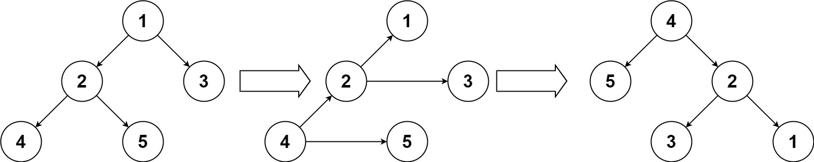

# 252 上下翻轉二叉樹

你一個二叉樹的根節點 root ，請你將此二叉樹上下翻轉，並返回新的根節點。

你可以按下面的步驟翻轉一棵二叉樹：

原來的左子節點變成新的根節點
原來的根節點變成新的右子節點
原來的右子節點變成新的左子節點

## Binary Tree Upside Down

Given the root of a binary tree, turn the tree upside down and return the new root.

You can turn a binary tree upside down with the following steps:

The original left child becomes the new root.
The original root becomes the new right child.
The original right child becomes the new left child.

[LeetCode](https://leetcode-cn.com/problems/binary-tree-upside-down)

### Example 1


```
Input: root = [1,2,3,4,5]
Output: [4,5,2,null,null,3,1]
```

### C++ 

```
/* Definition for a binary tree node. */
struct TreeNode
{
    int val;
    TreeNode *left;
    TreeNode *right;
    TreeNode() : val(0), left(nullptr), right(nullptr) {}
    TreeNode(int x) : val(x), left(nullptr), right(nullptr) {}
    TreeNode(int x, TreeNode *left, TreeNode *right) : val(x), left(left), right(right) {}
};

class Solution
{
private:
    TreeNode *ret{nullptr};
    void dfs(TreeNode *root, TreeNode *from, TreeNode *right)
    {
        if (root == nullptr)
            return;

        /* dfs*/
        dfs(root->left, root, root->right);
        if (ret == nullptr)
            ret = root;

        root->left = right;
        root->right = from;
    }

public:
    TreeNode *upsideDownBinaryTree(TreeNode *root)
    {
        if (root->left == nullptr)
            return root;

        dfs(root->left, root, root->right);
        root->left = nullptr;
        root->right = nullptr;

        return ret;
    }
};

int main()
{
    /* input*/
    TreeNode A(0), B(1), C(2), D(3), E(4), F(5);
    A.left = &B;
    A.right = &C;
    B.left = &D;
    B.right = &E;
    /* test*/

    Solution test;
    TreeNode *res = test.upsideDownBinaryTree(&A);
    return 0;
}

```
