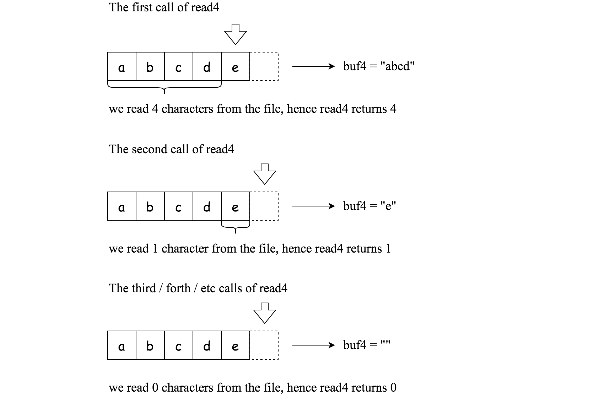

# 158 用 Read4 讀取 N 个字符 II

給你一個文件 file ，並且該文件只能通過給定的 read4 方法來讀取，請實現一個方法使其能夠使 read 讀取 n 個字符。注意：你的 read 方法可能會被調用多次。

read4 的定義：

read4 API 從文件中讀取 4 個連續的字符，然後將這些字符寫入緩沖區數組 buf4 。

返回值是讀取的實際字符數。

請注意，read4() 有其自己的文件指針，類似於 C 中的 FILE * fp 。
```
    參數類型: char[] buf4
    返回類型: int

注意: buf4[] 是目標緩存區不是源緩存區，read4 的返回結果將會覆制到 buf4[] 當中。
```

下列是一些使用 read4 的例子：



<b>read</b> 方法：

通過使用 read4 方法，實現 read 方法。該方法可以從文件中讀取 n 個字符並將其存儲到緩存數組 buf 中。您 不能 直接操作 file 。

返回值為實際讀取的字符。

<b>read</b> 的定義：

```
    參數類型:  char[] buf, int n
    返回類型:  int

注意: buf[] 是目標緩存區不是源緩存區，你需要將結果寫入 buf[] 中。
```

注意：

* 你<b>不能</b> 直接操作該文件，文件只能通過 read4 獲取而 不能 通過 read。
* read  函數可以被調用 多次。
* 請記得 重置 在 Solution 中聲明的類變量（靜態變量），因為類變量會 在多個測試用例中保持不變，影響判題準確。
* 你可以假定目標緩存數組 buf 保證有足夠的空間存下 n 個字符。 
* 保證在一個給定測試用例中，read 函數使用的是同一個 buf。

### Constraints

* 1 <= file.length <= 500
* file 由英语字母和数字组成
* 1 <= queries.length <= 10
* 1 <= queries[i] <= 500


[LeetCode](https://leetcode-cn.com/problems/read-n-characters-given-read4-ii-call-multiple-times/)


### Example 1


```
輸入： file = "abc"， queries = [1,2,1]
輸出：[1,2,0]
解釋：測試用例表示以下場景:
File file("abc");
Solution sol;
sol.read (buf, 1); // 調用 read 方法後，buf 應該包含 “a”。我們從文件中總共讀取了 1 個字符，所以返回 1。
sol.read (buf, 2); // 現在 buf 應該包含 "bc"。我們從文件中總共讀取了 2 個字符，所以返回 2。
sol.read (buf, 1); // 我們已經到達文件的末尾，不能讀取更多的字符。所以返回 0。
假設已經分配了 buf ，並保證有足夠的空間存儲文件中的所有字符。
```

### Example 2

```
輸入：file = "abc"， queries = [4,1]
輸出：[3,0]
解釋：測試用例表示以下場景:
File file("abc");
Solution sol;
sol.read (buf, 4); // 調用 read 方法後，buf 應該包含 “abc”。我們從文件中總共讀取了 3 個字符，所以返回 3。
sol.read (buf, 1); // 我們已經到達文件的末尾，不能讀取更多的字符。所以返回 0。
```

### C++ 

#### Recursion

```
/**
 * The read4 API is defined in the parent class Reader4.
 *     int read4(char *buf4);
 */

class Solution {
private:
    int available{0};
    char buf4[4];
public:
    /**
     * @param buf Destination buffer
     * @param n   Number of characters to read
     * @return    The number of actual characters read
     */
    int read(char *buf, int n) {
        /*
           1.紀錄目前可用的字符數 available
           2.buf4中為目前可使用的字符
           3.當目前可用的字符數小於要求，且可以讀入新的字符時
             不斷的將新字符加入目標字符串
           4.當數量夠時，將字符串輸出，同時將多餘沒用到的，回存到buf4中
             數量不夠時，也就只能輸出這麼多
        */

        /* 處理留在buf4中的字符*/
        if(available != 0)
            memcpy(buf, buf4, available);            

        int newLen = 0;
        while(available < n && ((newLen = read4(buf4)) != 0))
        {
            memcpy(buf + available, buf4, newLen);
            available += newLen;                        
        }

        if(available >= n)
        {   
            available -= n;            
            memset(buf4, 0, 4);            
            memcpy(buf4, buf + n, available);
            return n;
        }
        else
        { 
            int ret = available;
            available = 0;
            return ret;      
        } 
        
    }
};
```


