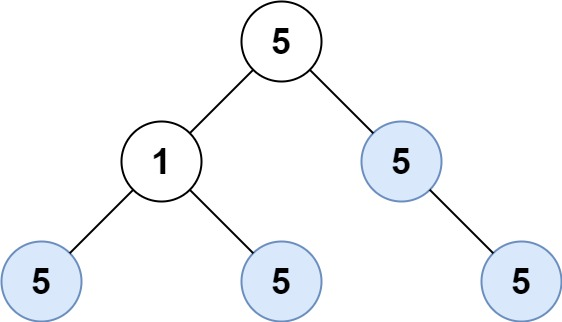

# 250 統計同值子樹

給定一個二叉樹，統計該二叉樹數值相同的子樹個數。

同值子樹是指該子樹的所有節點都擁有相同的數值。

## Count Univalue Subtrees

Given the root of a binary tree, return the number of uni-value subtrees.

A uni-value subtree means all nodes of the subtree have the same value.

[LeetCode](https://leetcode-cn.com/count-univalue-subtrees/)

### Example 1

 >
```
Input: root = [5,1,5,5,5,null,5]
Output: 4
```

### Example 2

```
Input: root = []
Output: 0
```

### C++ 

```
struct TreeNode
{
    int val;
    TreeNode *left;
    TreeNode *right;
    TreeNode() : val(0), left(nullptr), right(nullptr) {}
    TreeNode(int x) : val(x), left(nullptr), right(nullptr) {}
    TreeNode(int x, TreeNode *left, TreeNode *right) : val(x), left(left), right(right) {}
};

class Solution
{
private:
    int counter{0};
    const int nullVal{-10000};

    pair<bool, int> dfs(TreeNode *root)
    {
        if (root == nullptr)
            return {true, nullVal};
        /* 後序*/
        pair<bool, int> left = dfs(root->left);
        pair<bool, int> right = dfs(root->right);

        if (left.first == false || right.first == false )
        {
                return {false, root->val};
        }
        else if((left.second != nullVal && left.second != root->val) || (right.second != nullVal && right.second != root->val))
        {
                return {false, root->val};
        }
        else
        {
            counter++;
            return {true, root->val};
        }
    }

public:
    int countUnivalSubtrees(TreeNode *root)
    {

        (void)dfs(root);
        return counter;
    }
};

int main()
{
    TreeNode A(5), B(5), C(5);
    A.left = &B;
    A.right = &C;

    Solution test;
    int res = test.countUnivalSubtrees(&A);

    return 0;
}
```
