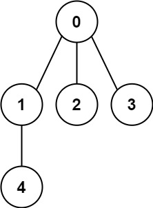

# 261  以圖判樹

給定從 0 到 n-1 標號的 n 個結點，和一個無向邊列表（每條邊以結點對來表示），請編寫一個函數用來判斷這些邊是否能夠形成一個合法有效的樹結構。

## Graph Valid Tree

You have a graph of n nodes labeled from 0 to n - 1. You are given an integer n and a list of edges where edges[i] = [ai, bi] indicates that there is an undirected edge between nodes ai and bi in the graph.

Return true if the edges of the given graph make up a valid tree, and false otherwise.

[LeetCode](https://leetcode-cn.com/problems/graph-valid-tree/)

### Example 1



```
Input: n = 5, edges = [[0,1],[0,2],[0,3],[1,4]]
Output: true
```

### Example 2


```
Input: n = 5, edges = [[0,1],[1,2],[2,3],[1,3],[1,4]]
Output: false
```

### C++ 

```
class Solution
{
public:
    bool validTree(int n, vector<vector<int>> &edges)
    {
        int &&len = edges.size();
        if (len != n - 1)
            return false;
        
        // build the links
        unordered_map<int, vector<int>> links;
        for(const auto& edge : edges)
        {
            links[edge[0]].push_back(edge[1]);
            links[edge[1]].push_back(edge[0]);
        }

        // start from point 0
        vector<bool> visted(n, false);
        queue<int> front;
        front.push(0);
        visted[0] = true;

        while(front.empty() != true)
        {
            int curr = front.front();
            front.pop();

            for(const auto& next : links[curr])
            {
                if(visted[next] == true)
                    continue;
                
                front.push(next);
                visted[next] = true;
            }
        }

        for(const auto node : visted)
        {
            if(node == false)
                return false;
        }

        return true;
    }
};
```
