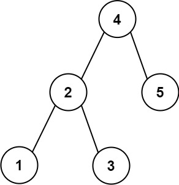

# 272 最接近的二叉搜索樹值 II

給定二叉搜索樹的根 root 、一個目標值 target 和一個整數 k ，返回BST中最接近目標的 k 個值。你可以按 任意順序 返回答案。

題目 保證 該二叉搜索樹中只會存在一種 k 個值集合最接近 target

##  Closest Binary Search Tree Value II

Given the root of a binary search tree, a target value, and an integer k, return the k values in the BST that are closest to the target. You may return the answer in any order.

You are guaranteed to have only one unique set of k values in the BST that are closest to the target.

### Constraints

* The number of nodes in the tree is n.
* 1 <= k <= n <= 10<sup>4</sup>
* 0 <= Node.val <= 10<sup>9</sup>
* -109 <= target <= 10<sup>9</sup>

[LeetCode](https://leetcode-cn.com/problems/closest-binary-search-tree-value-ii/)




### Example 1

```
Input: root = [4,2,5,1,3], target = 3.714286, k = 2
Output: [4,3]
```

### Example 2

```
Input: root = [1], target = 0.000000, k = 1
Output: [1]
```

### C++ 

```
/**
 * Definition for a binary tree node.
 * struct TreeNode {
 *     int val;
 *     TreeNode *left;
 *     TreeNode *right;
 *     TreeNode() : val(0), left(nullptr), right(nullptr) {}
 *     TreeNode(int x) : val(x), left(nullptr), right(nullptr) {}
 *     TreeNode(int x, TreeNode *left, TreeNode *right) : val(x), left(left), right(right) {}
 * };
 */
class Solution {
private:
    void addBig(TreeNode* root, stack<TreeNode*>& storage)
    {
        while(root != nullptr)
        {
            storage.push(root);
            root = root -> left;
        }
    }

    void addSmall(TreeNode* root, stack<TreeNode*>& storage)
    {
        while(root != nullptr)
        {
            storage.push(root);
            root = root -> right;
        }
    }
public:
    vector<int> closestKValues(TreeNode* root, double target, int k) {
        /*
        利用二叉搜索樹的特性，先找到最接近的兩個值，並將過程中的各點分別存在stack中
        每次stack中加入一個最接近的點，並加入下一個次大/次小的點進stack中
        */
        stack<TreeNode*> small;
        stack<TreeNode*> big;

        while(root != nullptr)
        {
            if(root -> val >= target)
            {
                big.push(root);
                root = root -> left;
            }
            else
            {
                small.push(root);
                root = root -> right;
            }
        }

        vector<int> ret;
        while(k != 0)
        {
            //找出大的跟小的中最接近的值
            TreeNode* smallTop = small.empty() == true? nullptr : small.top();
            TreeNode* bigTop = big.empty() == true? nullptr : big.top();

            if(smallTop == nullptr || (bigTop != nullptr && target - smallTop->val > bigTop->val - target)) //存在big中的比較近
            {
                ret.push_back(bigTop->val);
                big.pop(); 
                //加入比這個值稍大一點的
                addBig(bigTop -> right, big);
            }
            else
            {
                ret.push_back(smallTop->val);
                small.pop();
                //加入比這個值稍小一點的
                addSmall(smallTop -> left, small);
            }
            --k;
        }


        return ret;
    }
};
```


```
/**
 * Definition for a binary tree node.
 * struct TreeNode {
 *     int val;
 *     TreeNode *left;
 *     TreeNode *right;
 *     TreeNode() : val(0), left(nullptr), right(nullptr) {}
 *     TreeNode(int x) : val(x), left(nullptr), right(nullptr) {}
 *     TreeNode(int x, TreeNode *left, TreeNode *right) : val(x), left(left), right(right) {}
 * };
 */
class Solution {
private:
    vector<int> ret;
    void inOrder(TreeNode* root, int& ptr, const double& target, const int& len)
    {
        if(root == nullptr)
            return;

        inOrder(root -> left, ptr, target, len);

        if(ptr < len)
            ret[ptr++] = root -> val;
        else if(ptr >= len)
        {
            if(fabs((double)ret[ptr % len] - target) > fabs((double)root -> val - target) )
                ret[ptr++ % len] = root -> val;
            else    
                return;
        }

        inOrder(root -> right, ptr, target, len);
    }
public:
    vector<int> closestKValues(TreeNode* root, double target, int k) {
        /*
            二叉搜索樹，利用中序遍歷所得即為從小到大
            利用一容器保存值，當數量小於K時，添加新元素
            數量等於K時，最早加入的與等待加入的相較，取與target誤差轉小的
        */
        ret.resize(k);
        int ptr = 0;
        inOrder(root, ptr, target, k);

        return ret;
    }
};
```


