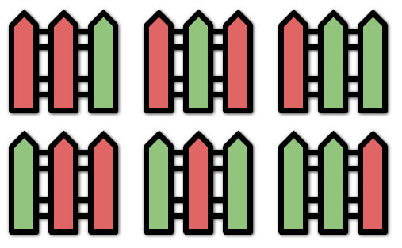

# 276 柵欄塗色

有 k 種顏色的塗料和一個包含 n 個柵欄柱的柵欄，請你按下述規則為柵欄設計塗色方案：

每個柵欄柱可以用其中 一種 顏色進行上色。
相鄰的柵欄柱 最多連續兩個 顏色相同。
給你兩個整數 k 和 n ，返回所有有效的塗色 方案數 。

## Paint Fence

You are painting a fence of n posts with k different colors. You must paint the posts following these rules:

Every post must be painted exactly one color.
There cannot be three or more consecutive posts with the same color.
Given the two integers n and k, return the number of ways you can paint the fence.

[LeetCode](https://leetcode-cn.com/paint-fence/)



### Example 1
```
Input: n = 3, k = 2
Output: 6
Explanation: All the possibilities are shown.
Note that painting all the posts red or all the posts green is invalid because there cannot be three posts in a row with the same color.
```

### C++ 

```
class Solution
{
public:
    int numWays(int n, int k)
    {
        /* Dynammic Programming, n個柵欄, k個顏色
           每一個柵欄有兩種狀態，和前一個同色，和前一個不同色*/

        vector<vector<int>> dp(2, vector<int>(n, 0));
        dp[1][0] = k;

        for (int i = 1; i < n; ++i)
        {
            dp[0][i] = dp[1][i - 1];
            dp[1][i] = (dp[0][i - 1] + dp[1][i - 1]) * (k - 1);
        }

        return dp[0][n - 1] + dp[1][n - 1];
    }
};
```
