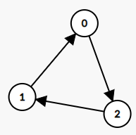

# 277 搜尋名人

假設你是一個專業的狗仔，參加了一個 n 人派對，其中每個人被從 0 到 n - 1 標號。在這個派對人群當中可能存在一位 “名人”。所謂 “名人” 的定義是：其他所有 n - 1 個人都認識他/她，而他/她並不認識其他任何人。

現在你想要確認這個 “名人” 是誰，或者確定這里沒有 “名人”。而你唯一能做的就是問諸如 “A 你好呀，請問你認不認識 B呀？” 的問題，以確定 A 是否認識 B。你需要在（漸近意義上）盡可能少的問題內來確定這位 “名人” 是誰（或者確定這里沒有 “名人”）。

在本題中，你可以使用輔助函數 bool knows(a, b) 獲取到 A 是否認識 B。請你來實現一個函數 int findCelebrity(n)。

派對最多只會有一個 “名人” 參加。若 “名人” 存在，請返回他/她的編號；若 “名人” 不存在，請返回 -1。

[LeetCode](https://leetcode-cn.com/problems/find-the-celebrity/)

### Example 1


```
Input: graph = [[1,1,0],[0,1,0],[1,1,1]]
Output: 1
Explanation: There are three persons labeled with 0, 1 and 2. graph[i][j] = 1 means person i knows person j, otherwise graph[i][j] = 0 means person i does not know person j. The celebrity is the person labeled as 1 because both 0 and 2 know him but 1 does not know anybody.
```

### Example 2



```
Input: graph = [[1,0,1],[1,1,0],[0,1,1]]
Output: -1
Explanation: There is no celebrity.
```

### C++ 

```
/* The knows API is defined for you.
      bool knows(int a, int b); */

class Solution {
public:
    int findCelebrity(int n) {
        //使用兩個指針，排除不可能的人
        int left = 0;
        int right = n - 1;

        while( left < right )
        {
            if(knows(left, right) == true)
                ++left;
            else if(knows(right, left) == true)
                --right;
        }
        
        if(left != right)
            return -1;

        return left;
    }
};
```
