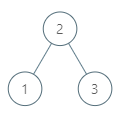

# 285 二叉搜索樹中的中序後繼

給定一棵二叉搜索樹和其中的一個節點 p ，找到該節點在樹中的中序後繼。如果節點沒有中序後繼，請返回 null 。

節點 p 的後繼是值比 p.val 大的節點中鍵值最小的節點。

## Inorder Successor in BST

Given the root of a binary search tree and a node p in it, return the in-order successor of that node in the BST. If the given node has no in-order successor in the tree, return null.

The successor of a node p is the node with the smallest key greater than p.val.

[LeetCode](https://leetcode-cn.com/inorder-successor-in-bst/)

### Example 1


```
Input: root = [2,1,3], p = 1
Output: 2
Explanation: 1's in-order successor node is 2. Note that both p and the return value is of TreeNode type.
```

### Example 2


```
Input: root = [5,3,6,2,4,null,null,1], p = 6
Output: null
Explanation: There is no in-order successor of the current node, so the answer is null.
```

### C++ 

```
/**
 * Definition for a binary tree node.
 * struct TreeNode {
 *     int val;
 *     TreeNode *left;
 *     TreeNode *right;
 *     TreeNode(int x) : val(x), left(NULL), right(NULL) {}
 * };
 */
class Solution {
private:
    bool found{false};
    TreeNode* ret{nullptr};
    void dfs(TreeNode* root, const TreeNode* p)
    {
        if(root == nullptr || ret != nullptr)
            return;
        
        dfs(root->left, p);

        if(root == p)
            found = true;        
        else if(found == true && ret == nullptr)
            ret = root;

        dfs(root->right, p);
    }
public:
    TreeNode* inorderSuccessor(TreeNode* root, TreeNode* p) {        
        dfs(root,  p);
        
        return ret;
    }
};
```
