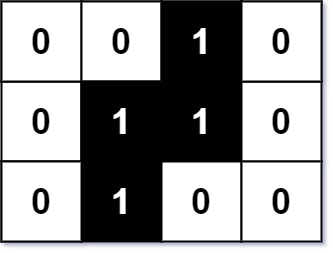

# 302 包含全部黑色像素的最小矩形

圖片在計算機處理中往往是使用二維矩陣來表示的。

給你一個大小為 m x n 的二進制矩陣 image 表示一張黑白圖片，0 代表白色像素，1 代表黑色像素。

黑色像素相互連接，也就是說，圖片中只會有一片連在一塊兒的黑色像素。像素點是水平或豎直方向連接的。

給你兩個整數 x 和 y 表示某一個黑色像素的位置，請你找出包含全部黑色像素的最小矩形（與坐標軸對齊），並返回該矩形的面積。

你必須設計並實現一個時間覆雜度低於 O(mn) 的算法來解決此問題。

##  Smallest Rectangle Enclosing Black Pixels

You are given an m x n binary matrix image where 0 represents a white pixel and 1 represents a black pixel.

The black pixels are connected (i.e., there is only one black region). Pixels are connected horizontally and vertically.

Given two integers x and y that represents the location of one of the black pixels, return the area of the smallest (axis-aligned) rectangle that encloses all black pixels.

You must write an algorithm with less than O(mn) runtime complexity

### Constraints

* m == image.length
* n == image[i].length
* 1 <= m, n <= 100
* image[i][j] is either '0' or '1'.
* 1 <= x < m
* 1 <= y < n
* image[x][y] == '1'.
* The black pixels in the image only form one component.

[LeetCode](https://leetcode-cn.com/problems/smallest-rectangle-enclosing-black-pixels/)




### Example 1

```
Input: image = [["0","0","1","0"],["0","1","1","0"],["0","1","0","0"]], x = 0, y = 2
Output: 6
```

### Example 2

```
Input: image = [["1"]], x = 0, y = 0
Output: 1
```

### C++ 

```
class Solution {
private:
    const int moves[4][2] {{-1,0}, {1,0}, {0,-1},{0,1}};
public:
    int minArea(vector<vector<char>>& image, int x, int y) {
        /*
            第一個黑色像素的點，將他加入隊列
            從該點開始拓展，並紀錄下上下左右各方向的極值
        */
        int rowNum = image.size();
        int colNum = image[0].size();

        stack<pair<int,int>> frontier;
        frontier.push({x,y});
        image[x][y] = '0';

        int top = rowNum - 1;;
        int bottom = 0;
        int left = colNum - 1;
        int right = 0;
        while(frontier.empty() != true)
        {
            pair<int,int> temp = frontier.top();
            frontier.pop();
            top = min(top,temp.first);
            bottom = max(bottom, temp.first);
            left = min(left, temp.second);
            right = max(right, temp.second);

            for(int i = 0; i < 4; ++i)
            {
                int&& nextRow = temp.first + moves[i][0];
                int&& nextCol = temp.second + moves[i][1];
                if(nextRow >= 0 && nextRow < rowNum && nextCol >= 0 && nextCol < colNum && image[nextRow][nextCol] == '1')
                {
                    frontier.push({nextRow, nextCol});
                    image[nextRow][nextCol] = '0';
                }
            }
        }

        return (bottom - top + 1)*(right - left + 1);

    }
};
```


