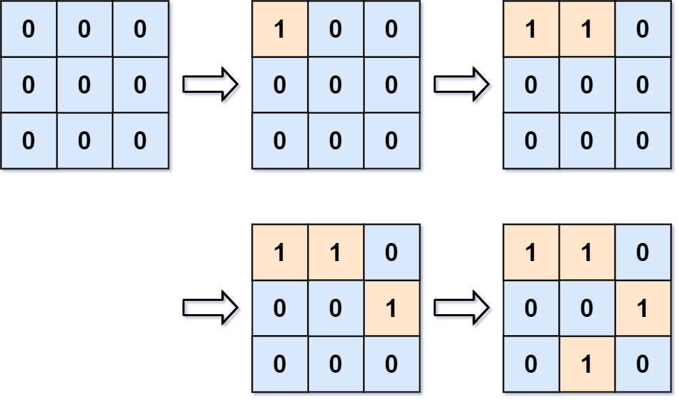

# 305 島嶼數量 II

給你一個大小為 m x n 的二進制網格 grid 。網格表示一個地圖，其中，0 表示水，1 表示陸地。最初，grid 中的所有單元格都是水單元格（即，所有單元格都是 0）。

可以通過執行 addLand 操作，將某個位置的水轉換成陸地。給你一個數組 positions ，其中 positions[i] = [ri, ci] 是要執行第 i 次操作的位置 (ri, ci) 。

返回一個整數數組 answer ，其中 answer[i] 是將單元格 (ri, ci) 轉換為陸地後，地圖中島嶼的數量。

島嶼 的定義是被「水」包圍的「陸地」，通過水平方向或者垂直方向上相鄰的陸地連接而成。你可以假設地圖網格的四邊均被無邊無際的「水」所包圍。

##  Number of Islands II

You are given an empty 2D binary grid grid of size m x n. The grid represents a map where 0's represent water and 1's represent land. Initially, all the cells of grid are water cells (i.e., all the cells are 0's).

We may perform an add land operation which turns the water at position into a land. You are given an array positions where positions[i] = [ri, ci] is the position (ri, ci) at which we should operate the ith operation.

Return an array of integers answer where answer[i] is the number of islands after turning the cell (ri, ci) into a land.

An island is surrounded by water and is formed by connecting adjacent lands horizontally or vertically. You may assume all four edges of the grid are all surrounded by water.

### Constraints

* 1 <= m, n, positions.length <= 10<sup>4</sup>
* 1 <= m * n <= 10<sup>4</sup>
* positions[i].length == 2
* 0 <= ri < m
* 0 <= ci < n

[LeetCode](https://leetcode-cn.com/problems/smallest-rectangle-enclosing-black-pixels/)




### Example 1

```
Input: m = 3, n = 3, positions = [[0,0],[0,1],[1,2],[2,1]]
Output: [1,1,2,3]
Explanation:
Initially, the 2d grid is filled with water.
- Operation #1: addLand(0, 0) turns the water at grid[0][0] into a land. We have 1 island.
- Operation #2: addLand(0, 1) turns the water at grid[0][1] into a land. We still have 1 island.
- Operation #3: addLand(1, 2) turns the water at grid[1][2] into a land. We have 2 islands.
- Operation #4: addLand(2, 1) turns the water at grid[2][1] into a land. We have 3 islands.
```

### Example 2

```
Input: m = 1, n = 1, positions = [[0,0]]
Output: [1]
```

### C++ 

```
class Solution {
private:
    map<pair<int,int>, pair<int,int>>parent;
    const int moves[4][2]{{-1,0},{1,0},{0,-1}, {0,1}};
    int count{0};
    pair<int, int> unionFind(const pair<int,int> x)
    {
        if(parent[x] != x)
            parent[x] = unionFind(parent[x]);
        
        return parent[x];
    }

    void unionSet(pair<int, int>x, pair<int, int> y)
    {
        x = unionFind(x);
        y = unionFind(y);

        if(x == y)
            return;
        
        --count;
        if(x > y)
            swap(x,y);

        parent[y] = x;
    }
public:
    vector<int> numIslands2(int m, int n, vector<vector<int>>& positions) {
        /*
            使用並查集
            每加入一個新位置，先假設多增加一個獨立的點 count++
            map[x,y] = (x,y)
            再向四個方向拓展，若有相聯的陸地
            使用unionSet相聯，若尚未聯結過，則count--
        */
        int&& len = positions.size();

        vector<vector<bool>> grid(m, vector<bool>(n));    
        vector<int> ret;

        for(const vector<int>& position : positions)
        {
            if(grid[position[0]][position[1]] != true)
            {
                ++count;
                grid[position[0]][position[1]] = true;  //該位置設為陸地
                parent[{position[0], position[1]}] = {position[0], position[1]}; // 先將parent設為自己
                for(int i = 0; i < 4; ++i)
                {
                    int&& nextR = position[0] + moves[i][0];
                    int&& nextC = position[1] + moves[i][1];
                    if(nextR >= 0 && nextR < m && nextC >= 0 && nextC < n && grid[nextR][nextC] == true) //有相鄰的陸地
                        unionSet({position[0], position[1]},{nextR, nextC});
                }
            }
            ret.push_back(count);
        }

        return ret;
    }
};
```


