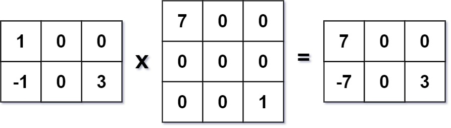

# 311 稀疏矩陣的乘法

給你兩個 稀疏矩陣 A 和 B，請你返回 AB 的結果。你可以默認 A 的列數等於 B 的行數。

## Sparse Matrix Multiplication

Given two sparse matrices mat1 of size m x k and mat2 of size k x n, return the result of mat1 x mat2. You may assume that multiplication is always possible.

[LeetCode](https://leetcode-cn.com/sparse-matrix-multiplication/)

### Example 1



```
Input: mat1 = [[1,0,0],[-1,0,3]], mat2 = [[7,0,0],[0,0,0],[0,0,1]]
Output: [[7,0,0],[-7,0,3]]
```

### Example 2

```
Input: mat1 = [[0]], mat2 = [[0]]
Output: [[0]]
```

### C++ 

```
class Solution {

public:
    vector<vector<int>> multiply(vector<vector<int>>& mat1, vector<vector<int>>& mat2) {
        int mat1Row = mat1.size();
        int mat1Col = mat1[0].size();
        int mat2Row = mat2.size();
        int mat2Col = mat2[0].size();

        //最終的結果為 mat1Row * mat2Col
        vector<vector<int>> ret(mat1Row, vector<int>(mat2Col, 0));
        for(int row = 0; row < mat1Row; ++row)
        {
            for(int col = 0; col < mat2Col; ++col)
            {
                int tempSum = 0;
                for(int i = 0; i < mat1Col; ++i)
                {
                    tempSum += mat1[row][i]*mat2[i][col];
                }
                ret[row][col] = tempSum;
            }
        }

        return ret;
    }
};
```
