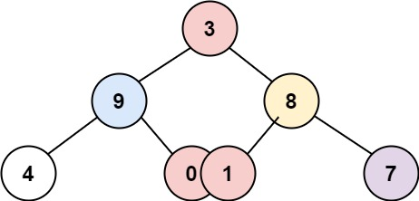

# 314 二叉樹的垂直遍歷

給你一個二叉樹的根結點，返回其結點按 垂直方向（從上到下，逐列）遍歷的結果。

如果兩個結點在同一行和列，那麽順序則為 從左到右。

## Binary Tree Vertical Order Traversal

Given the root of a binary tree, return the vertical order traversal of its nodes' values. (i.e., from top to bottom, column by column).

If two nodes are in the same row and column, the order should be from left to right.


[LeetCode](https://leetcode-cn.com/binary-tree-vertical-order-traversal/)

### Example 1


```
Input: root = [3,9,20,null,null,15,7]
Output: [[9],[3,15],[20],[7]]
```

### Example 2



```
Input: root = [3,9,8,4,0,1,7]
Output: [[4],[9],[3,0,1],[8],[7]]
```
### Example 3


```
Input: root = [3,9,8,4,0,1,7,null,null,null,2,5]
Output: [[4],[9,5],[3,0,1],[8,2],[7]]
```

### C++ 

```
/* Definition for a binary tree node. */
  struct TreeNode {
      int val;
      TreeNode *left;
      TreeNode *right;
      TreeNode() : val(0), left(nullptr), right(nullptr) {}
      TreeNode(int x) : val(x), left(nullptr), right(nullptr) {}
      TreeNode(int x, TreeNode *left, TreeNode *right) : val(x), left(left), right(right) {}
  };
 
class Solution {
    vector<vector<int>> ret;
    map<int, vector<int>> hash;
    void dfs(TreeNode* root, int id)
    {
        if(root == nullptr)
            return;
        
        hash[id].push_back(root->val);

        dfs(root->left, id - 1);
        dfs(root->right, id + 1);
    }
public:
    vector<vector<int>> verticalOrder(TreeNode* root) {
        // dfs
        dfs(root, 0);

        map<int, vector<int>>::iterator it; 
        for(it = hash.begin(); it != hash.end(); it++)
        {
            ret.emplace_back(it->second);
        }
        
        return ret;
    }
};

int main()
{
    TreeNode A(0), B(1), C(2), D(3), E(4);
    A.left = &B;
    A.right = &C;
    B.left = &D;
    C.right = &E;

    Solution test;
    vector<vector<int>> res = test.verticalOrder(&A);
    

    return 0;
}
```
