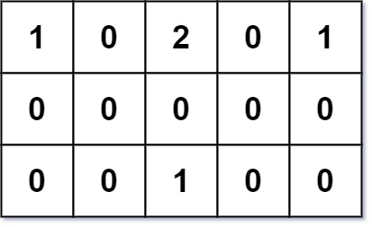

# 317 離建築物最近的距離

給你一個 m × n 的網格，值為 0 、 1 或 2 ，其中:

每一個 0 代表一塊你可以自由通過的 空地 
每一個 1 代表一個你不能通過的 建築
每個 2 標記一個你不能通過的 障礙 
你想要在一塊空地上建造一所房子，在 最短的總旅行距離 內到達所有的建築。你只能上下左右移動。

返回到該房子的 最短旅行距離 。如果根據上述規則無法建造這樣的房子，則返回 -1 。

總旅行距離 是朋友們家到聚會地點的距離之和。

使用 曼哈頓距離 計算距離，其中距離 (p1, p2) = |p2.x - p1.x | + | p2.y - p1.y | 。


##  Shortest Distance from All Buildings

You are given an m x n grid grid of values 0, 1, or 2, where:

each 0 marks an empty land that you can pass by freely,
each 1 marks a building that you cannot pass through, and
each 2 marks an obstacle that you cannot pass through.
You want to build a house on an empty land that reaches all buildings in the shortest total travel distance. You can only move up, down, left, and right.

Return the shortest travel distance for such a house. If it is not possible to build such a house according to the above rules, return -1.

The total travel distance is the sum of the distances between the houses of the friends and the meeting point.

The distance is calculated using Manhattan Distance, where distance(p1, p2) = |p2.x - p1.x| + |p2.y - p1.y|.

### Constraints

* m == grid.length
* n == grid[i].length
* 1 <= m, n <= 50
* grid[i][j] is either 0, 1, or 2.
* There will be at least one building in the grid.

[LeetCode](https://leetcode-cn.com/problems/shortest-distance-from-all-buildings/)




### Example 1

```
Input: grid = [[1,0,2,0,1],[0,0,0,0,0],[0,0,1,0,0]]
Output: 7
Explanation: Given three buildings at (0,0), (0,4), (2,2), and an obstacle at (0,2).
The point (1,2) is an ideal empty land to build a house, as the total travel distance of 3+3+1=7 is minimal.
So return 7.
```

### Example 2

```
Input: grid = [[1,0]]
Output: 1
```

### C++ 

```
class Solution {
private:
    const int moves[4][2]{{-1,0}, {1,0}, {0,-1}, {0,1}};
public:
    int shortestDistance(vector<vector<int>>& grid) {
        /*
            每當碰到一個房子，就進行一次BFS, 記下各個空格到該房子的距離
            但也要確保每次拓展的點，是之前有拓展過的，這邊利用每一次BFS，就將可踩上的點 -1
            而下一次拓展bfs時，就必需踩上之-1的點，這樣就確保了必定是之前拓展過的
        */
        int&& rowNum = grid.size();
        int&& colNum = grid[0].size();

        vector<vector<int>>totalDist(rowNum, vector<int>(colNum));
        queue<pair<int,int>> frontier;
        int target = 0;
        int minDist = INT_MAX;

        for(int row = 0; row < rowNum; ++row)
        {
            for(int col = 0; col < colNum; ++col)
            {
                if(grid[row][col] == 1)
                {
                    minDist = INT_MAX;
                    vector<vector<int>>dist(rowNum, vector<int>(colNum));
                    frontier.push({row, col});

                    while(frontier.empty() != true)
                    {
                        pair<int,int> curr = frontier.front();
                        frontier.pop();

                        for(int i = 0;  i < 4; ++i)
                        {
                            int&& nextR = curr.first + moves[i][0];
                            int&& nextC = curr.second + moves[i][1];
                            if(nextR >= 0 && nextR < rowNum && nextC >= 0 && nextC < colNum && grid[nextR][nextC] == target)
                            {
                                frontier.push({nextR, nextC});
                                --grid[nextR][nextC];
                                dist[nextR][nextC] = dist[curr.first][curr.second] + 1;
                                totalDist[nextR][nextC] += dist[nextR][nextC];
                                minDist = min(minDist, totalDist[nextR][nextC]);
                            }
                        }
                    }
                    --target;
                }
            }
        }
        return minDist  == INT_MAX? -1 : minDist;        
    }

   
};
```


