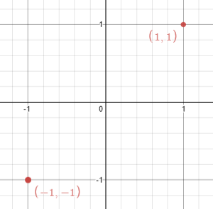

# 356 直線鏡像

在一個二維平面空間中，給你 n 個點的坐標。問，是否能找出一條平行於 y 軸的直線，讓這些點關於這條直線成鏡像排布？

注意：題目數據中可能有重覆的點。

## Line Reflection

Given n points on a 2D plane, find if there is such a line parallel to the y-axis that reflects the given points symmetrically.

In other words, answer whether or not if there exists a line that after reflecting all points over the given line, the original points' set is the same as the reflected ones.

Note that there can be repeated points.

[LeetCode](https://leetcode-cn.com/problems/line-reflection/)

### Example 1


```
Input: points = [[1,1],[-1,1]]
Output: true
Explanation: We can choose the line x = 0.
```

### Example 2



```
Input: points = [[1,1],[-1,-1]]
Output: false
Explanation: We can't choose a line.

```

### C++ 

```
#include <vector>
#include <set>

using namespace std;

class Solution
{
public:
    bool isReflected(vector<vector<int>> &points)
    {
        //全部壓遍，不用分層，找最左邊跟最右邊的點，求暫時性的中間點
        int left = INT_MAX;
        int right = INT_MIN;
        set<vector<int>> pointSet;
        for(const vector<int>& point : points)
        {
            left = min(left, point[0]);
            right = max(right, point[0]);
            pointSet.insert(point);
        }

        int mid = left + right;
        //是否有相對應的另一點
        for(const vector<int>& point : pointSet)
        {
            vector<int> target = {mid - point[0], point[1]};
            if(pointSet.find(target) == pointSet.end())
                return false;
        }

        return true;
    }
};

int main()
{
    vector<vector<int>> input = {{-16, 1}, {16, 1}, {16, 1}};

    Solution test;
    bool res = test.isReflected(input);

    return 0;
}
};
```
