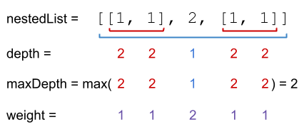

# 364 加權嵌套序列和 II

給你一個整數嵌套列表 nestedList ，每一個元素要麽是一個整數，要麽是一個列表（這個列表中的每個元素也同樣是整數或列表）。

整數的 深度 取決於它位於多少個列表內部。例如，嵌套列表 [1,[2,2],[[3],2],1] 的每個整數的值都等於它的 深度 。令 maxDepth 是任意整數的 最大深度 。

整數的 權重 為 maxDepth - (整數的深度) + 1 。

將 nestedList 列表中每個整數先乘權重再求和，返回該加權和。

## Nested List Weight Sum II

You are given a nested list of integers nestedList. Each element is either an integer or a list whose elements may also be integers or other lists.

The depth of an integer is the number of lists that it is inside of. For example, the nested list [1,[2,2],[[3],2],1] has each integer's value set to its depth. Let maxDepth be the maximum depth of any integer.

The weight of an integer is maxDepth - (the depth of the integer) + 1.

Return the sum of each integer in nestedList multiplied by its weight.


[LeetCode](https://leetcode-cn.com/nested-list-weight-sum-ii/)

### Example 1


```
Input: nestedList = [[1,1],2,[1,1]]
Output: 8
Explanation: Four 1's with a weight of 1, one 2 with a weight of 2.
1*1 + 1*1 + 2*2 + 1*1 + 1*1 = 8
```
### Example 2


```
Input: nestedList = [1,[4,[6]]]
Output: 17
Explanation: One 1 at depth 3, one 4 at depth 2, and one 6 at depth 1.
1*3 + 4*2 + 6*1 = 17
```

### C++ 

```
class Solution {
private:
    vector<pair<int,int>>depthList; //第一個存放數字，第二個存放深度
    int maxDepth{0};
    void dfs(const vector<NestedInteger>& nestedList, int& depth)
    {
        ++depth;
        maxDepth = max(maxDepth, depth);
        for(int i = 0; i < nestedList.size(); ++i)
        {
            if(nestedList[i].isInteger() == true)
                depthList.push_back(make_pair(nestedList[i].getInteger(), depth));
            else
                dfs(nestedList[i].getList(), depth);
        }
        --depth;
    }
public:
    int depthSumInverse(vector<NestedInteger>& nestedList) {
        int sum = 0;
        int&& depth = 0;
        dfs(nestedList, depth);

        for(const auto& data : depthList)
        {
            sum += data.first * (maxDepth - data.second + 1);
        }

        return sum;
    }
};
```
