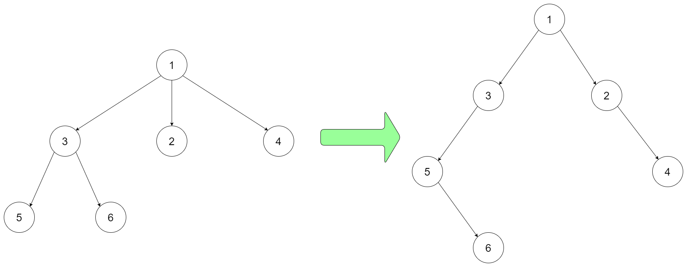

# 431  將 N 叉樹編碼為二叉樹

設計一個算法，可以將 N 叉樹編碼為二叉樹，並能將該二叉樹解碼為原 N 叉樹。一個 N 叉樹是指每個節點都有不超過 N 個孩子節點的有根樹。類似地，一個二叉樹是指每個節點都有不超過 2 個孩子節點的有根樹。你的編碼 / 解碼的算法的實現沒有限制，你只需要保證一個 N 叉樹可以編碼為二叉樹且該二叉樹可以解碼回原始 N 叉樹即可。

例如，你可以將下面的 3-叉 樹以該種方式編碼：




注意，上面的方法僅僅是一個例子，可能可行也可能不可行。你沒有必要遵循這種形式轉化，你可以自己創造和實現不同的方法。

注意：

N 的範圍在 [1, 1000]
不要使用類成員 / 全局變量 / 靜態變量來存儲狀態。你的編碼和解碼算法應是無狀態的。

## Encode N-ary Tree to Binary Tree

Design an algorithm to encode an N-ary tree into a binary tree and decode the binary tree to get the original N-ary tree. An N-ary tree is a rooted tree in which each node has no more than N children. Similarly, a binary tree is a rooted tree in which each node has no more than 2 children. There is no restriction on how your encode/decode algorithm should work. You just need to ensure that an N-ary tree can be encoded to a binary tree and this binary tree can be decoded to the original N-nary tree structure.

Nary-Tree input serialization is represented in their level order traversal, each group of children is separated by the null value (See following example).

For example, you may encode the following 3-ary tree to a binary tree in this way:

### Constraints

* The number of nodes in the tree is in the range [0, 10<sup>4</sup>].
* 0 <= Node.val <= 10<sup>4</sup>
* The height of the n-ary tree is less than or equal to 1000
* Do not use class member/global/static variables to store states. Your encode and decode algorithms should be stateless.

[LeetCode](https://leetcode-cn.com/problems/encode-n-ary-tree-to-binary-tree/)


### C++ 

```
/*
// Definition for a Node.
class Node {
public:
    int val;
    vector<Node*> children;

    Node() {}

    Node(int _val) {
        val = _val;
    }

    Node(int _val, vector<Node*> _children) {
        val = _val;
        children = _children;
    }
};
*/

/**
 * Definition for a binary tree node.
 * struct TreeNode {
 *     int val;
 *     TreeNode *left;
 *     TreeNode *right;
 *     TreeNode(int x) : val(x), left(NULL), right(NULL) {}
 * };
 */

class Codec {
public:
    // Encodes an n-ary tree to a binary tree.
    TreeNode* encode(Node* root) {
        /*
            使用BFS，當在遍歷每點的子節點時，同時建立新的節點
            新建立的子節點若屬同一個父節點，以右分支相連，左分支連子節點
        */
        if(root == nullptr)
            return nullptr;

        queue<pair<Node*, TreeNode*>> que;
        TreeNode* retHead = new TreeNode(root -> val);
        que.emplace(root, retHead);

        while(que.empty() != true)
        {
            pair<Node*, TreeNode*> curr = que.front();
            que.pop();
            
            // N-node的子節點
            TreeNode* head = nullptr;
            TreeNode* tail = nullptr;
            for(Node* next : curr.first -> children)
            {
                TreeNode* temp = new TreeNode(next -> val);
                que.emplace(next, temp);
                //建立關系，同一個父節點的以右分支相連
                if(head == nullptr)
                    head = temp;
                else
                    tail -> right = temp;
                tail = temp;                
            }
            curr.second -> left = head;
        }

        return retHead;
        
    }
	
    // Decodes your binary tree to an n-ary tree.
    Node* decode(TreeNode* root) {
        if(root == nullptr)
            return nullptr;
        
        queue<pair<TreeNode*, Node*>> que;
        Node* retHead = new Node(root -> val);
        que.emplace(root, retHead);

        while(que.empty() != true)
        {
            pair<TreeNode*, Node*> curr = que.front();
            que.pop();

            // 從curr的第一個左分支開始，全部往右分支搜
            TreeNode* next = curr.first->left;
            while(next != nullptr)
            {
                Node* temp = new Node(next -> val);
                que.emplace(next, temp);
                curr.second->children.push_back(temp);
                next = next -> right;
            }
        }
        
        return retHead;
    }
};

// Your Codec object will be instantiated and called as such:
// Codec codec;
// codec.decode(codec.encode(root));
```


