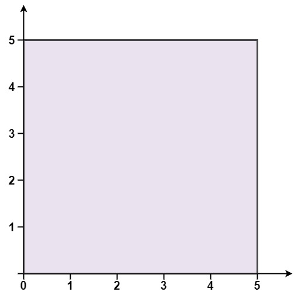

# 469 凸多邊型

給定一個按順序連接的多邊形的頂點，判斷該多邊形是否為凸多邊形。（凸多邊形的定義）

* 頂點個數至少為 3 個且不超過 10,000。
* 坐標範圍為 -10,000 到 10,000。
* 你可以假定給定的點形成的多邊形均為簡單多邊形
  保證每個頂點處恰好是兩條邊的匯合點，並且這些邊 互不相交 。

## Convex Polygon

You are given an array of points on the X-Y plane points where points[i] = [xi, yi]. The points form a polygon when joined sequentially.

Return true if this polygon is convex and false otherwise.

You may assume the polygon formed by given points is always a simple polygon. In other words, we ensure that exactly two edges intersect at each vertex and that edges otherwise don't intersect each other.


[LeetCode](https://leetcode-cn.com/problems/convex-polygon/)

### Example 1



```
Input: points = [[0,0],[0,5],[5,5],[5,0]]
Output: true
```

### Example 2


```
Input: points = [[0,0],[0,10],[10,10],[10,0],[5,5]]
Output: false
```


### C++ 

```
class Solution {
public:
    bool isConvex(vector<vector<int>>& points) {
        //使用向量外積，求得的法向量是否指向同一側
        int&& len = points.size();
        int lastDir = 0;
        bool initialized = false;
        for(int i = 0; i < len; ++i)
        {
           int vec1x = points[(i + 1) % len][0] - points[i][0];
           int vec1y = points[(i + 1) % len][1] - points[i][1];

           int vec2x = points[(i + 2) % len][0] - points[(i + 1) % len][0];
           int vec2y = points[(i + 2) % len][1] - points[(i + 1) % len][1];

           int curr = vec1x * vec2y - vec2x * vec1y;

           if(curr != 0 )
           {
                if((long)curr * lastDir < 0)
                    return false;
                lastDir = curr;
            }           
        } 
        return true;
    }
};
```
