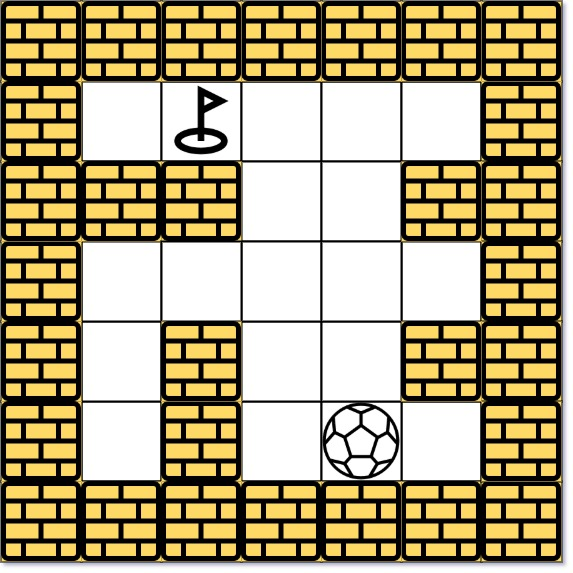
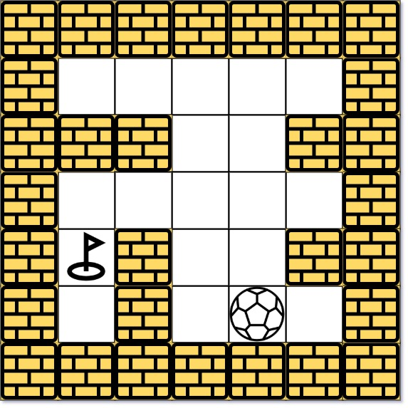

# 499 迷宫 III

由空地和墻組成的迷宮中有一個球。球可以向上（u）下（d）左（l）右（r）四個方向滾動，但在遇到墻壁前不會停止滾動。當球停下時，可以選擇下一個方向。迷宮中還有一個洞，當球運動經過洞時，就會掉進洞里。

給定球的起始位置，目的地和迷宮，找出讓球以最短距離掉進洞里的路徑。 距離的定義是球從起始位置（不包括）到目的地（包括）經過的空地個數。通過'u', 'd', 'l' 和 'r'輸出球的移動方向。 由於可能有多條最短路徑， 請輸出字典序最小的路徑。如果球無法進入洞，輸出"impossible"。

迷宮由一個0和1的二維數組表示。 1表示墻壁，0表示空地。你可以假定迷宮的邊緣都是墻壁。起始位置和目的地的坐標通過行號和列號給出。

## The Maze III

There is a ball in a maze with empty spaces (represented as 0) and walls (represented as 1). The ball can go through the empty spaces by rolling up, down, left or right, but it won't stop rolling until hitting a wall. When the ball stops, it could choose the next direction. There is also a hole in this maze. The ball will drop into the hole if it rolls onto the hole.

Given the m x n maze, the ball's position ball and the hole's position hole, where ball = [ballrow, ballcol] and hole = [holerow, holecol], return a string instructions of all the instructions that the ball should follow to drop in the hole with the shortest distance possible. If there are multiple valid instructions, return the lexicographically minimum one. If the ball can't drop in the hole, return "impossible".

If there is a way for the ball to drop in the hole, the answer instructions should contain the characters 'u' (i.e., up), 'd' (i.e., down), 'l' (i.e., left), and 'r' (i.e., right).

The distance is the number of empty spaces traveled by the ball from the start position (excluded) to the destination (included).

You may assume that the borders of the maze are all walls (see examples).

[LeetCode](https://leetcode-cn.com/the-maze-iii/)

### Example 1



```
Input: maze = [[0,0,0,0,0],[1,1,0,0,1],[0,0,0,0,0],[0,1,0,0,1],[0,1,0,0,0]], ball = [4,3], hole = [0,1]
Output: "lul"
Explanation: There are two shortest ways for the ball to drop into the hole.
The first way is left -> up -> left, represented by "lul".
The second way is up -> left, represented by 'ul'.
Both ways have shortest distance 6, but the first way is lexicographically smaller because 'l' < 'u'. So the output is "lul".
```

### Example 2



```
Input: maze = [[0,0,0,0,0],[1,1,0,0,1],[0,0,0,0,0],[0,1,0,0,1],[0,1,0,0,0]], ball = [4,3], hole = [3,0]
Output: "impossible"
Explanation: The ball cannot reach the hole.
```

### C++ 

```
class Solution {
private:
    struct node
    {
        int row{0};
        int col{0};
        int cost{0};
        string path;
        node(){}
        node(int a, int b):row(a), col(b){}
        node(int a, int b, int c, string str):row(a), col(b), cost(c), path(str){}
    };

    struct comp
    {
        bool operator()(const node& lhs, const node& rhs)
        {
            if(lhs.cost == rhs.cost)
                return lhs.path > rhs.path;

            return lhs.cost > rhs.cost;
        }
    };
    
    int moves[4][2] = {{-1,0},{1,0},{0,-1},{0,1}};  //上下左右
    char dir[4] = {'u','d','l','r'};
    unordered_map<char, char> revDir = {{'u','d'},{'d','u'},{'r','l'},{'l','r'}};
    vector<vector<int>> dist;
    vector<vector<string>> path;
    vector<vector<bool>> visted;
public:
    string findShortestWay(vector<vector<int>>& maze, vector<int>& ball, vector<int>& hole) {
        int&& rowNum = maze.size();
        int&& colNum = maze[0].size();
        
        dist.resize(rowNum, vector<int>(colNum, INT_MAX));    //輸入起點的資訊
        path.resize(rowNum, vector<string>(colNum, "impossible"));
        visted.resize(rowNum, vector<bool>(colNum, false));
        dist[ball[0]][ball[1]] = 0;
        path[ball[0]][ball[1]] = "";

        priority_queue<node, vector<node>, comp> que;
        que.emplace(ball[0], ball[1], 0, "");

        while(que.empty() != true)
        {
            node curr = que.top();
            que.pop();

            if(visted[curr.row][curr.col] == true)
                continue;
            visted[curr.row][curr.col] = true;

            if(curr.row == hole[0] && curr.col == hole[1])
                break;

            //下一個點
            for(int i = 0; i < 4; ++i)
            {
                if(curr.path.length() > 0 && (revDir[curr.path.back()] == dir[i] || curr.path.back() == dir[i]))  //剪枝，如果走回頭路的話
                    continue;
                int&& nextR = curr.row + moves[i][0];
                int&& nextC = curr.col + moves[i][1];
                int nexCost = curr.cost;
                string&& nexPath = curr.path + dir[i];
                while(nextR >= 0 && nextR < rowNum && nextC >= 0 && nextC < colNum && maze[nextR][nextC] == 0
                      && (nextR - moves[i][0] != hole[0] || nextC - moves[i][1] != hole[1]))
                {
                    ++nexCost;
                    nextR += moves[i][0];
                    nextC += moves[i][1];
                }
                nextR -= moves[i][0];
                nextC -= moves[i][1];
                
                //dijkstra算法的重點，如果算出來的距離比該位置目前求得的距離短，就更新
                if(nexCost < dist[nextR][nextC] || (nexCost == dist[nextR][nextC] && nexPath < path[nextR][nextC]))
                {
                    dist[nextR][nextC] = nexCost;
                    path[nextR][nextC] = nexPath;
                    que.emplace(nextR, nextC, nexCost, nexPath);
                }
            }
        }       

        return path[hole[0]][hole[1]];        
    }
};
```
