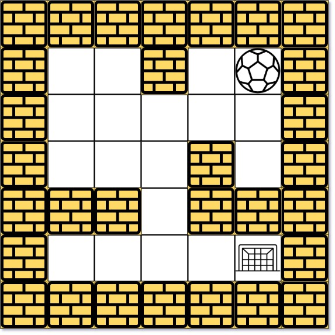

# 505 迷宮 II

由空地和墻組成的迷宮中有一個球。球可以向上下左右四個方向滾動，但在遇到墻壁前不會停止滾動。當球停下時，可以選擇下一個方向。

給定球的起始位置，目的地和迷宮，找出讓球停在目的地的最短距離。距離的定義是球從起始位置（不包括）到目的地（包括）經過的空地個數。如果球無法停在目的地，返回 -1。

迷宮由一個0和1的二維數組表示。 1表示墻壁，0表示空地。你可以假定迷宮的邊緣都是墻壁。起始位置和目的地的坐標通過行號和列號給出。

## The Maze II

There is a ball in a maze with empty spaces (represented as 0) and walls (represented as 1). The ball can go through the empty spaces by rolling up, down, left or right, but it won't stop rolling until hitting a wall. When the ball stops, it could choose the next direction.

Given the m x n maze, the ball's start position and the destination, where start = [startrow, startcol] and destination = [destinationrow, destinationcol], return the shortest distance for the ball to stop at the destination. If the ball cannot stop at destination, return -1.

The distance is the number of empty spaces traveled by the ball from the start position (excluded) to the destination (included).

You may assume that the borders of the maze are all walls (see examples).


[LeetCode](https://leetcode-cn.com/problems/the-maze-ii/)

### Example 1



```
Input: maze = [[0,0,1,0,0],[0,0,0,0,0],[0,0,0,1,0],[1,1,0,1,1],[0,0,0,0,0]], start = [0,4], destination = [4,4]
Output: true
Explanation: One possible way is : left -> down -> left -> down -> right -> down -> right.
```

### Example 2


```
Input: maze = [[0,0,1,0,0],[0,0,0,0,0],[0,0,0,1,0],[1,1,0,1,1],[0,0,0,0,0]], start = [0,4], destination = [3,2]
Output: false
Explanation: There is no way for the ball to stop at the destination. Notice that you can pass through the destination but you cannot stop there.
```

### C++ 


```
class Solution {
private:
    int movement[4][2] = {{1,0},{-1,0},{0,1},{0,-1}};
    struct data
    {
        int row;
        int col;
        int dist;
        data( int x, int y, int z): row(x), col(y), dist(z){}
        data(const data& rhs): row(rhs.row), col(rhs.col), dist(rhs.dist){}

        data(data&& rhs):row(rhs.row), col(rhs.col), dist(rhs.dist){}
    };

    
public:
    int shortestDistance(vector<vector<int>>& maze, vector<int>& start, vector<int>& destination) {

        int&& rowNum = maze.size();
        int&& colNum = maze[0].size();

        vector<vector<int>> visted(rowNum, vector<int>(colNum, -1));
        queue<data> frontier;
        //將第一點放入列
        frontier.emplace(data(start[0], start[1], 0));

        while(frontier.empty() != true)
        {
            data curr = std::move(frontier.front());
            frontier.pop(); 

            for(int i = 0; i < 4; ++i)
            {
                int nextRow = curr.row;
                int nextCol = curr.col;
                int nextDist = curr.dist;

                while(nextRow >= 0 && nextRow < rowNum \
                && nextCol >= 0 && nextCol < colNum \
                && maze[nextRow][nextCol] == 0
                )
                {
                    nextRow += movement[i][0];
                    nextCol += movement[i][1];
                    ++nextDist;    
                }
                //撞到障礙物，回到上一個
                nextRow -= movement[i][0];
                nextCol -= movement[i][1];
                --nextDist; 
                                
                if(visted[nextRow][nextCol] == -1 || visted[nextRow][nextCol] > nextDist)
                {
                    visted[nextRow][nextCol] = nextDist;
                    frontier.emplace(data(nextRow, nextCol, nextDist));
                }
            }  
        }

        return visted[destination[0]][destination[1]];
    }
};

```
