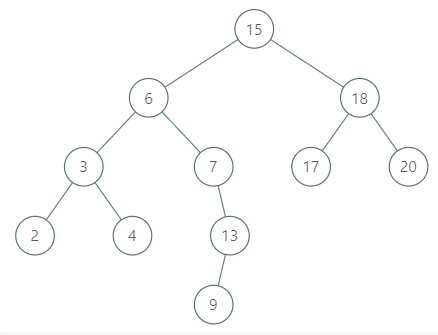

# 510 二叉搜索樹中的中序後繼 II

給定一棵二叉搜索樹和其中的一個節點 node ，找到該節點在樹中的中序後繼。如果節點沒有中序後繼，請返回 null 。

一個節點 node 的中序後繼是鍵值比 node.val 大所有的節點中鍵值最小的那個。

你可以直接訪問結點，但無法直接訪問樹。每個節點都會有其父節點的引用。節點 Node 定義如下：

## Inorder Successor in BST II

Given a node in a binary search tree, return the in-order successor of that node in the BST. If that node has no in-order successor, return null.

The successor of a node is the node with the smallest key greater than node.val.

You will have direct access to the node but not to the root of the tree. Each node will have a reference to its parent node. Below is the definition for Node:
```
class Node {
    public int val;
    public Node left;
    public Node right;
    public Node parent;
}
```

[LeetCode](https://leetcode-cn.com/problems/inorder-successor-in-bst-ii/)

### Example 1


```
Input: tree = [5,3,6,2,4,null,null,1], node = 6
Output: null
Explanation: There is no in-order successor of the current node, so the answer is null.
```

### Example 2



```
Input: tree = [15,6,18,3,7,17,20,2,4,null,13,null,null,null,null,null,null,null,null,9], node = 15
Output: 17
```

### C++ 


```
/*
// Definition for a Node.
class Node {
public:
    int val;
    Node* left;
    Node* right;
    Node* parent;
};
*/

class Solution {
private:
    Node* ret{nullptr};
    Node* start{nullptr};

    void dfs(Node* root)
    {
        if(root == nullptr)
            return;

        dfs(root->left);
        if(ret == nullptr)
        {    
            ret = root;
            return;
        }
        dfs(root->right);
    }
    
public:
    Node* inorderSuccessor(Node* node) {      
        start = node;

        //找第一個大於node->val的數
        if(node -> right != nullptr)
            dfs(node -> right);      
        else if(node->parent != nullptr && node -> val < node -> parent ->val)
            ret = node->parent;    
        else
        {
            while(node->parent != nullptr && node -> val <= start -> val)
                node = node->parent;
            if( node->val > start->val )
                ret = node;
        }        

        return ret;
    }
};
```
