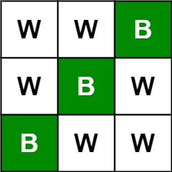
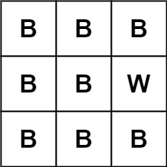

# 531 孤獨像素 I

給你一個大小為 m x n 的圖像 picture ，圖像由黑白像素組成，'B' 表示黑色像素，'W' 表示白色像素，請你統計並返回圖像中 黑色 孤獨像素的數量。

黑色孤獨像素 的定義為：如果黑色像素 'B' 所在的同一行和同一列不存在其他黑色像素，那麼這個黑色像素就是黑色孤獨像素。

## Lonely Pixel I

Given an m x n picture consisting of black 'B' and white 'W' pixels, return the number of black lonely pixels.

A black lonely pixel is a character 'B' that located at a specific position where the same row and same column don't have any other black pixels.

[LeetCode](https://leetcode-cn.com/lonely-pixel-i/)

### Example 1



```
Input: picture = [["W","W","B"],["W","B","W"],["B","W","W"]]
Output: 3
Explanation: All the three 'B's are black lonely pixels.
```

### Example 2



```
Input: picture = [["B","B","B"],["B","B","W"],["B","B","B"]]
Output: 0
```

### Example 3


```
Input: n = 4, edges = [[0,1],[0,2],[1,3],[2,3]], source = 0, destination = 3
Output: true
```

### Example 4


```
Input: n = 3, edges = [[0,1],[1,1],[1,2]], source = 0, destination = 2
Output: false
Explanation: All paths from the source node end at the destination node, but there are an infinite number of paths, such as 0-1-2, 0-1-1-2, 0-1-1-1-2, 0-1-1-1-1-2, and so on.
```

### C++ 


```
class Solution {
public:
    bool leadsToDestination(int n, vector<vector<int>>& edges, int source, int destination) {
        //由終點出發，確認是否可到達出發點
        vector<int> count(n,0);
        unordered_map<int, vector<int>> path;
        for(const vector<int> edge : edges)
        {
            path[edge[1]].push_back(edge[0]);
            ++count[edge[0]];
        }
        // destination是否入度為 0
        if(count[destination] != 0)
            return false;
        
        queue<int> frontier;
        frontier.push(destination);

        while(frontier.empty() != true)
        {
            int temp = frontier.front();
            frontier.pop();

            if(temp == source)
                return true;

            for(const int& next : path[temp])
            {
                if(--count[next] == 0)
                    frontier.push(next);
            }
        }

        return false;
    }
};
```
