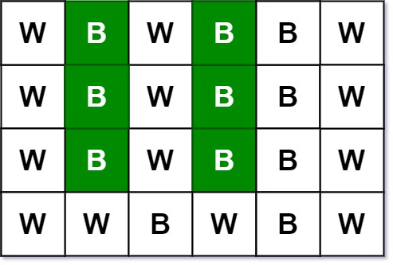
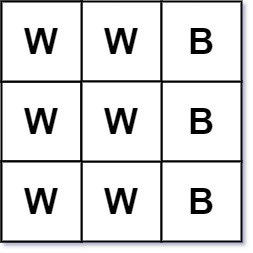

# 533 孤獨像素 II

給你一個大小為 m x n 的二維字符數組 picture ，表示一張黑白圖像，數組中的 'B' 表示黑色像素，'W' 表示白色像素。另給你一個整數 target ，請你找出並返回符合規則的 黑色 孤獨像素的數量。

黑色孤獨像素是指位於某一特定位置 (r, c) 的字符 'B' ，其中：

* 行 r 和列 c 中的黑色像素恰好有 target 個。
* 列 c 中所有黑色像素所在的行必須和行 r 完全相同。
 

## Lonely Pixel II

Given an m x n picture consisting of black 'B' and white 'W' pixels and an integer target, return the number of black lonely pixels.

A black lonely pixel is a character 'B' that located at a specific position (r, c) where:

* Row r and column c both contain exactly target black pixels.
* For all rows that have a black pixel at column c, they should be exactly the same as row r.

[LeetCode](https://leetcode-cn.com/problems/lonely-pixel-ii/)

### Example 1



```
Input: picture = [["W","B","W","B","B","W"],["W","B","W","B","B","W"],["W","B","W","B","B","W"],["W","W","B","W","B","W"]], target = 3
Output: 6
Explanation: All the green 'B' are the black pixels we need (all 'B's at column 1 and 3).
Take 'B' at row r = 0 and column c = 1 as an example:
 - Rule 1, row r = 0 and column c = 1 both have exactly target = 3 black pixels. 
 - Rule 2, the rows have black pixel at column c = 1 are row 0, row 1 and row 2. They are exactly the same as row r = 0.

```

### Example 2



```
Input: picture = [["W","W","B"],["W","W","B"],["W","W","B"]], target = 1
Output: 0

```

### C++ 

```
class Solution {
public:
    int findBlackPixel(vector<vector<char>>& picture, int target) {
        int&& rowNum = picture.size();
        int&& colNum = picture[0].size();

        vector<int> rowCount(rowNum, 0);
        vector<int> colCount(colNum, 0);

                for(int row = 0; row < rowNum; ++row)
        {
            for( int col = 0; col < colNum; ++col)
            {
                if(picture[row][col] == 'B')
                {
                    ++rowCount[row];
                    ++colCount[col];
                }
            }
        }

        int count = 0;
        set<int> colChecked;
        for(int row = 0; row < rowNum; ++row)
        {
            for( int col = 0; col < colNum; ++col)
            {
                if(picture[row][col] == 'B' && rowCount[row] == target && colCount[col] == target && colChecked.find(col) == colChecked.end())
                {
                    int currRow = row;
                    int tmpCount = 1;
                    colChecked.insert(col);
                    for( int i = row + 1; i < rowNum; ++i)
                    {
                        if(picture[i][col] == 'B' && picture[currRow] == picture[i])
                            ++tmpCount;

                        if(tmpCount == target)
                            break; 
                    }

                    if(tmpCount == target)   
                        count += tmpCount;                    
                }
            }
        }

        return count;
    }
};
```
