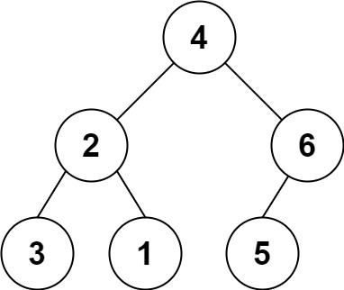

# 536 從字符串生成二叉樹

你需要從一個包括括號和整數的字符串構建一棵二叉樹。

輸入的字符串代表一棵二叉樹。它包括整數和隨後的 0 ，1 或 2 對括號。整數代表根的值，一對括號內表示同樣結構的子樹。

若存在左子結點，則從左子結點開始構建。
 

## Construct Binary Tree from String

You need to construct a binary tree from a string consisting of parenthesis and integers.

The whole input represents a binary tree. It contains an integer followed by zero, one or two pairs of parenthesis. The integer represents the root's value and a pair of parenthesis contains a child binary tree with the same structure.

You always start to construct the left child node of the parent first if it exists.

[LeetCode](https://leetcode-cn.com/construct-binary-tree-from-string/)

### Example 1



```
Input: s = "4(2(3)(1))(6(5))"
Output: [4,2,6,3,1,5]
```

### Example 2

```
Input: s = "4(2(3)(1))(6(5)(7))"
Output: [4,2,6,3,1,5,7]
```

### C++ 

```
class Solution
{
private:
    TreeNode *dfs(const string &s, int &id, const int&& len)
    {
        if (id >= len || s[id] == ')')
            return nullptr;       

        //取得數字
        int offset = 0;
        while (s[id] == '(') //更新起始位置
            ++id;
        while (id + offset < len && s[id + offset] != '(' && s[id + offset] != ')') //更新結束位置
            ++offset;
        int tmpVal = stoi(s.substr(id, offset));

        // 建立新的 node
        TreeNode *curr = new TreeNode(tmpVal);

        id += offset; //下一個起始位置
        
        //左子樹
        if (id < len && s[id] == '(')
            curr->left = dfs(s, ++id, move(len));
        //右子樹
        if (id < len && s[id] == '(')
            curr->right = dfs(s, ++id, move(len));
        
        ++id;

        return curr;
    }

public:
    TreeNode *str2tree(string s)
    {
        //len = s.length();
        TreeNode head(0);

        int strId = 0;
        head.left = dfs(s, strId, s.length());

        return head.left;
    }
};
```
