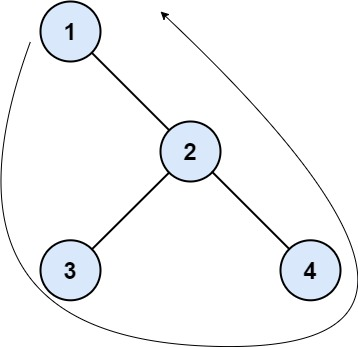

# 545 二叉樹的邊界

二叉樹的 邊界 是由 根節點 、左邊界 、按從左到右順序的 葉節點 和 逆序的右邊界 ，按順序依次連接組成。

左邊界 是滿足下述定義的節點集合：

* 根節點的左子節點在左邊界中。如果根節點不含左子節點，那麽左邊界就為 空 。
* 如果一個節點在左邊界中，並且該節點有左子節點，那麽它的左子節點也在左邊界中。
* 如果一個節點在左邊界中，並且該節點 不含 左子節點，那麽它的右子節點就在左邊界中。
* 最左側的葉節點 不在 左邊界中。

右邊界 定義方式與 左邊界 相同，只是將左替換成右。即，右邊界是根節點右子樹的右側部分；葉節點 不是 右邊界的組成部分；如果根節點不含右子節點，那麽右邊界為 空 。

葉節點 是沒有任何子節點的節點。對於此問題，根節點 不是 葉節點。

給你一棵二叉樹的根節點 root ，按順序返回組成二叉樹 邊界 的這些值。


## Boundary of Binary Tree

The boundary of a binary tree is the concatenation of the root, the left boundary, the leaves ordered from left-to-right, and the reverse order of the right boundary.

The left boundary is the set of nodes defined by the following:

* The root node's left child is in the left boundary. If the root does not have a left child, then the left boundary is empty.
* If a node in the left boundary and has a left child, then the left child is in the left boundary.
* If a node is in the left boundary, has no left child, but has a right child, then the right child is in the left boundary.
* The leftmost leaf is not in the left boundary.
The right boundary is similar to the left boundary, except it is the right side of the root's right subtree. Again, the leaf is not part of the right boundary, and the right boundary is empty if the root does not have a right child.

The leaves are nodes that do not have any children. For this problem, the root is not a leaf.

Given the root of a binary tree, return the values of its boundary.

[LeetCode](https://leetcode-cn.com/problems/boundary-of-binary-tree/)

### Example 1



```
Input: root = [1,null,2,3,4]
Output: [1,3,4,2]
Explanation:
- The left boundary is empty because the root does not have a left child.
- The right boundary follows the path starting from the root's right child 2 -> 4.
  4 is a leaf, so the right boundary is [2].
- The leaves from left to right are [3,4].
Concatenating everything results in [1] + [] + [3,4] + [2] = [1,3,4,2].
```

### Example 2


```
Input: root = [1,2,3,4,5,6,null,null,null,7,8,9,10]
Output: [1,2,4,7,8,9,10,6,3]
Explanation:
- The left boundary follows the path starting from the root's left child 2 -> 4.
  4 is a leaf, so the left boundary is [2].
- The right boundary follows the path starting from the root's right child 3 -> 6 -> 10.
  10 is a leaf, so the right boundary is [3,6], and in reverse order is [6,3].
- The leaves from left to right are [4,7,8,9,10].
Concatenating everything results in [1] + [2] + [4,7,8,9,10] + [6,3] = [1,2,4,7,8,9,10,6,3].

```

### C++ 

```
class Solution {
private:
    vector<int> bound;
    void leftDfs(TreeNode* root) //回傳是否無空節點
    {       
        if(root -> left != nullptr) //優先往左分支走
        {   
            bound.push_back(root->val);
            leftDfs(root->left);
        }
        else if(root -> right != nullptr)
        {
            bound.push_back(root->val);
            leftDfs(root -> right);
        }
    }

    void rightDfs(TreeNode* root) //回傳是否無空節點
    {
        if(root -> right != nullptr) //優先往右分支走
        {   
            bound.push_back(root->val);
            rightDfs(root->right);
        }
        else if(root -> left != nullptr)
        {
            bound.push_back(root->val);
            rightDfs(root -> left);
        }
    }

    bool dfs(TreeNode* root)
    {
        if(root == nullptr)
            return false;
        
        bool left = dfs(root->left);
        bool right = dfs(root->right);
        if( left == false && right == false )
            bound.push_back(root->val);
        
        return true;
    }
public:
    vector<int> boundaryOfBinaryTree(TreeNode* root) {
        bound.push_back(root->val);
        if(root -> left == nullptr && root -> right == nullptr)
            return bound;
            
        //左邊界
        if(root -> left != nullptr)
            leftDfs(root -> left);
        dfs(root);
        int len = bound.size();
        if(root -> right != nullptr)
            rightDfs(root -> right);
        std::reverse(bound.begin() + len, bound.end());

        return bound;
    }
};
```
