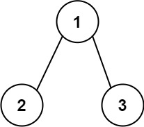
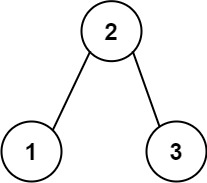

# 545 二叉樹中最長的連續序列

給定一個二叉樹，你需要找出二叉樹中最長的連續序列路徑的長度。

請注意，該路徑可以是遞增的或者是遞減。例如，[1,2,3,4] 和 [4,3,2,1] 都被認為是合法的，而路徑 [1,2,4,3] 則不合法。另一方面，路徑可以是 子-父-子 順序，並不一定是 父-子 順序。


## Binary Tree Longest Consecutive Sequence II

Given the root of a binary tree, return the length of the longest consecutive path in the tree.

A consecutive path is a path where the values of the consecutive nodes in the path differ by one. This path can be either increasing or decreasing.

For example, [1,2,3,4] and [4,3,2,1] are both considered valid, but the path [1,2,4,3] is not valid.
On the other hand, the path can be in the child-Parent-child order, where not necessarily be parent-child order.

* The number of nodes in the tree is in the range [1, 3 * 104].
* -3 * 104 <= Node.val <= 3 * 104

[LeetCode](https://leetcode-cn.com/binary-tree-longest-consecutive-sequence-ii/)

### Example 1



```
Input: root = [1,2,3]
Output: 2
Explanation: The longest consecutive path is [1, 2] or [2, 1].
```

### Example 2



```
Input: root = [2,1,3]
Output: 3
Explanation: The longest consecutive path is [1, 2, 3] or [3, 2, 1].
```

### C++ 

```
/**
 * Definition for a binary tree node.
 * struct TreeNode {
 *     int val;
 *     TreeNode *left;
 *     TreeNode *right;
 *     TreeNode() : val(0), left(nullptr), right(nullptr) {}
 *     TreeNode(int x) : val(x), left(nullptr), right(nullptr) {}
 *     TreeNode(int x, TreeNode *left, TreeNode *right) : val(x), left(left), right(right) {}
 * };
 */
class Solution {
private:
    int maxLen{1};
    struct nodeData
    {
        int val{0};
        int addLen{0};
        int minusLen{0};
    };

    nodeData postOrder(TreeNode* root)
    {
        if(root == nullptr)
            return {INT_MIN, 0,0};

        nodeData leftNode = postOrder(root->left);
        nodeData rightNode = postOrder(root->right);
        int tempAddLen = 0;
        int tempMinusLen = 0;
        //左邊回傳data
        if(leftNode.val != INT_MIN) //有回傳資料
        {
            if( root->val - leftNode.val == 1)
                tempMinusLen = 1 + leftNode.minusLen;
            else if( leftNode.val - root->val == 1)
                tempAddLen = 1 + leftNode.addLen;
        }
        //右邊回傳data
        if(rightNode.val != INT_MIN)
        {
            if( root->val - rightNode.val == 1)
                tempMinusLen = max(tempMinusLen, 1 + rightNode.minusLen);
            else if( rightNode.val - root->val == 1)
                tempAddLen = max(tempAddLen, 1 + rightNode.addLen);
        }
        //處理該node資訊
        maxLen = max(maxLen, tempAddLen + tempMinusLen + 1);

        return {root->val, tempAddLen, tempMinusLen};
    }

public:
    int longestConsecutive(TreeNode* root) {
        
        (void)postOrder(root);

        return maxLen;
    }
};
```
