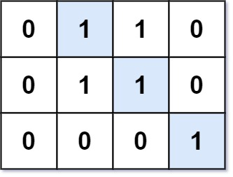

# 562 矩陣中最長的連續1線段

給定一個01矩陣 M，找到矩陣中最長的連續1線段。這條線段可以是水平的、垂直的、對角線的或者反對角線的。


##  Longest Line of Consecutive One in Matrix

Given an m x n binary matrix mat, return the length of the longest line of consecutive one in the matrix.

The line could be horizontal, vertical, diagonal, or anti-diagonal.

[LeetCode](https://leetcode-cn.com/problems/longest-line-of-consecutive-one-in-matrix/)

### Example 1



```
Input: mat = [[0,1,1,0],[0,1,1,0],[0,0,0,1]]
Output: 3
```

### Example 2


```
Input: mat = [[1,1,1,1],[0,1,1,0],[0,0,0,1]]
Output: 4
```

### C++ 

```
class Solution {
    struct score
    {
        int hori{0};
        int vert{0};
        int diag{0};
        int antiDiag{0};
        void set()
        {
            hori = 1;
            vert = 1;
            diag = 1;
            antiDiag = 1;
        }
    };

public:
    int longestLine(vector<vector<int>>& mat) {
        int&& rowNum = mat.size();
        int&& colNum = mat[0].size();
        int&& lastCol = colNum - 1;
        int maxLen = 0;

        vector<vector<score>> dp(rowNum, vector<score>(colNum));

        // process  dp space
        for(int row = 0; row < rowNum; ++row)
        {
            for(int col = 0; col < colNum; ++col)
            {
                if(mat[row][col] == 1)
                {   
                    dp[row][col].set();           
                    if(col != 0)      
                        dp[row][col].hori += dp[row][col - 1].hori;  //水平
                    if(row != 0)
                        dp[row][col].vert += dp[row - 1][col].vert; //垂直
                    if(row != 0 && col != 0)
                        dp[row][col].diag += dp[row - 1][col - 1].diag; //斜向
                    if(row != 0 && col != lastCol)
                        dp[row][col].antiDiag += dp[row - 1][col + 1].antiDiag; //檢查反斜向 

                    maxLen = max({maxLen, dp[row][col].hori, dp[row][col].vert, dp[row][col].diag, dp[row][col].antiDiag}); 
                }
            }
        }

        return maxLen;
    }
};
```
