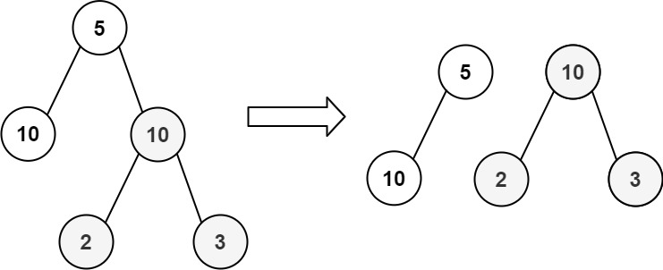
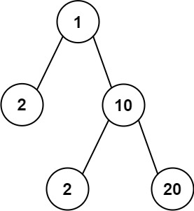

# 663 均勻樹劃分

給定一棵有 n 個結點的二叉樹，你的任務是檢查是否可以通過去掉樹上的一條邊將樹分成兩棵，且這兩棵樹結點之和相等。

## Equal Tree Partition

Given the `root` of a binary tree, return `true` if you can partition the tree into two trees with equal sums of values after removing exactly one edge on the original tree.

### Constraints

* The number of nodes in the tree is in the range [1, 10<sup>4</sup>].
* -10<sup>5</sup> <= Node.val <= 10<sup>5</sup>

[LeetCode](https://leetcode-cn.com/problems/equal-tree-partition/)


### Example 1


```
Input: root = [5,10,10,null,null,2,3]
Output: true
```


### Example 2
```
Input: root = [1,2,10,null,null,2,20]
Output: false
Explanation: You cannot split the tree into two trees with equal sums after removing exactly one edge on the tree.
```

### C++ 

```
/**
 * Definition for a binary tree node.
 * struct TreeNode {
 *     int val;
 *     TreeNode *left;
 *     TreeNode *right;
 *     TreeNode() : val(0), left(nullptr), right(nullptr) {}
 *     TreeNode(int x) : val(x), left(nullptr), right(nullptr) {}
 *     TreeNode(int x, TreeNode *left, TreeNode *right) : val(x), left(left), right(right) {}
 * };
 */
class Solution {

private:
    bool ret{false};
    TreeNode* start{nullptr};
    int postOrder(TreeNode* root, const int& target, const bool& check)
    {
        if(root == nullptr || ret == true)
            return 0;
        
        int&& left = postOrder(root->left, target, check);
        int&& right = postOrder(root->right, target, check);
        int&& sum = root->val + left + right;
        
        if(check == true && sum == target && root != start)
            ret = true;

        return sum;
    }
public:
    bool checkEqualTree(TreeNode* root) {
        start = root;
        //先計算樹的總值
        int&& sum = postOrder(root,0,  false);
        if(sum & 1)
            return false;
        
        (void)postOrder(root, sum/2, true);

        return ret;
    }
};
```
