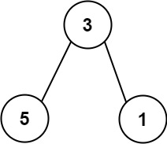

# 666 路徑總和 IV

對於一棵深度小於`5`的樹，可以用一組三位十進制整數來表示。

對於每個整數：

* 百位上的數字表示這個節點的深度 D，1 <= D <= 4。
* 十位上的數字表示這個節點在當前層所在的位置 P， 1 <= P <= 8。位置編號與一棵滿二叉樹的位置編號相同。
* 個位上的數字表示這個節點的權值 V，0 <= V <= 9。
給定一個包含三位整數的升序數組，表示一棵深度小於 5 的二叉樹，請你返回從根到所有葉子結點的路徑之和。

## Equal Tree Partition

If the depth of a tree is smaller than 5, then this tree can be represented by an array of three-digit integers. For each integer in this array:

* The hundreds digit represents the depth d of this node where 1 <= d <= 4.
* The tens digit represents the position p of this node in the level it belongs to where 1 <= p <= 8. The position is the same as that in a full binary tree.
* The units digit represents the value v of this node where 0 <= v <= 9.
Given an array of ascending three-digit integers nums representing a binary tree with a depth smaller than 5, return the sum of all paths from the root towards the leaves.

It is guaranteed that the given array represents a valid connected binary tree.

### Constraints

* 1 <= nums.length <= 15
* 110 <= nums[i] <= 489
* nums represents a valid binary tree with depth less than 5.

[LeetCode](https://leetcode-cn.com/problems/path-sum-iv/)


### Example 1


```
Input: nums = [113,215,221]
Output: 12
Explanation: The tree that the list represents is shown.
The path sum is (3 + 5) + (3 + 1) = 12.
```


### Example 2

```
Input: nums = [113,221]
Output: 4
Explanation: The tree that the list represents is shown. 
The path sum is (3 + 1) = 4.
```

### C++ 

```
class Solution
{

public:
    int pathSum(vector<int> &nums)
    {
        unordered_map<int, pair<int, bool>> valMap;
        /**
         * @brief 
         * 將所有的數字處理存入 valMap中
         * 第1及第1位組成id，第3位為值
         * 如：   111      21這個位置要找 其百位 - 1 ->1
         *      /    \                   (其十位 + 1) /2 - > 1
         *    212    223                 找11這個id的值相加
         *    找到父節點時，同時將父節點內標註為true代表其有子節點
         *    最後loop整個map，將沒有true的數字加總
         */

        for (const int &num : nums)
        {
            //其要找的父節點
            int &&val = num % 10;
            int &&id = num / 10 % 10;
            int &&depth = num / 100;

            int &&parent = (depth - 1) * 10 + (id + 1) / 2;

            if (valMap.find(parent) != valMap.end())
            {
                valMap[parent].second = true;
                val += valMap[parent].first;
            }

            valMap[num / 10] = {val, false};
        }
        int sum = 0;
        for (const auto &data : valMap)
        {
            if (data.second.second == false)
                sum += data.second.first;
        }              

        return sum;
    }
};
```
