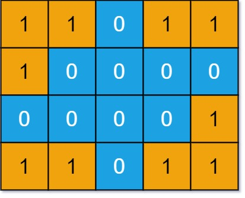

# 不同島嶼的數量

給定一個非空 01 二維數組表示的網格，一個島嶼由四連通（上、下、左、右四個方向）的 1 組成，你可以認為網格的四周被海水包圍。

請你計算這個網格中共有多少個形狀不同的島嶼。兩個島嶼被認為是相同的，當且僅當一個島嶼可以通過平移變換（不可以旋轉、翻轉）和另一個島嶼重合。

## Number of Distinct Islands

You are given an m x n binary matrix grid. An island is a group of 1's (representing land) connected 4-directionally (horizontal or vertical.) 
You may assume all four edges of the grid are surrounded by water.

An island is considered to be the same as another if and only if one island can be translated (and not rotated or reflected) to equal the other.

Return the number of <b>distinct</b> islands.

### Constraints

* m == grid.length
* n == grid[i].length
* 1 <= m, n <= 50
* grid[i][j] is either 0 or 1.

[LeetCode](https://leetcode-cn.com/problems/number-of-distinct-islands/)


### Example 1


```
Input: grid = [[1,1,0,0,0],[1,1,0,0,0],[0,0,0,1,1],[0,0,0,1,1]]
Output: 1
```

### Example 2



```
Input: grid = [[1,1,0,1,1],[1,0,0,0,0],[0,0,0,0,1],[1,1,0,1,1]]
Output: 3
```

### C++ 

```
class Solution {
private:
    vector<vector<int>> moves = {{-1,0},{1,0},{0,-1},{0,1}};//上下左右
    int rowNum{0};
    int colNum{0};
public:
    int numDistinctIslands(vector<vector<int>>& grid) {
        rowNum = grid.size();
        colNum = grid[0].size();       
        set<string>paths;

        //遍歷整個grid，從是陸地的地方(1)開始dfs        
        int count = 0; //暫時性，用來測試下方的dfs
        for(int row = 0; row < rowNum; ++row)
        {
            for(int col = 0; col < colNum; ++col)
            {
                if(grid[row][col] == 1) //找到一塊陸地，開始dfs
                {
                    string path;
                    dfs(grid, row, col, -1, path); 
                    paths.insert(move(path));
                }
            }
        }
        return paths.size();
    }

    void dfs(vector<vector<int>>& grid, const int& row, const int& col, const int& lastMove, const int& move, string& path)
    {
        if(grid[row][col] == 0)
            return;
        
        grid[row][col] = 0;          //先將該位址改成0，以此來代替visted
        //紀錄路徑
        path += to_string(move);
        for( int i = 0; i < 4; ++i)
        {
            int&& nextRow = row + moves[i][0];
            int&& nextCol = col + moves[i][1];
            if(nextRow >= 0 && nextRow < rowNum && nextCol >= 0 && nextCol < colNum )
                dfs(grid, nextRow, nextCol, i, path);                                
        }
    }
};
```
