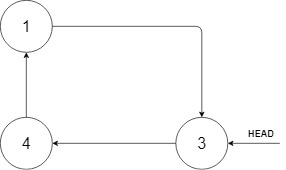

# 708 循环有序列表的插入

給定循環單調非遞減列表中的一個點，寫一個函數向這個列表中插入一個新元素 insertVal ，使這個列表仍然是循環非降序的。

給定的可以是這個列表中任意一個頂點的指針，並不一定是這個列表中最小元素的指針。

如果有多個滿足條件的插入位置，你可以選擇任意一個位置插入新的值，插入後整個列表仍然保持有序。


## Insert into a Sorted Circular Linked List

Given a Circular Linked List node, which is sorted in ascending order, write a function to insert a value insertVal into the list such that it remains a sorted circular list. The given node can be a reference to any single node in the list and may not necessarily be the smallest value in the circular list.

If there are multiple suitable places for insertion, you may choose any place to insert the new value. After the insertion, the circular list should remain sorted.

If the list is empty (i.e., the given node is null), you should create a new single circular list and return the reference to that single node. Otherwise, you should return the originally given node.

### Constraints

* The number of nodes in the list is in the range [0, 5 * 10<sup>4</sup>].
* -10<sup>6</sup> <= Node.val, insertVal <= 10<sup>6</sup>


[LeetCode](https://leetcode-cn.com/problems/insert-into-a-sorted-circular-linked-list/)


### Example 1




```
Input: head = [3,4,1], insertVal = 2
Output: [3,4,1,2]
Explanation: In the figure above, there is a sorted circular list of three elements. You are given a reference to the node with value 3, and we need to insert 2 into the list. The new node should be inserted between node 1 and node 3. After the insertion, the list should look like this, and we should still return node 3.
```

### Example 2

```
Input: head = [], insertVal = 1
Output: [1]
Explanation: The list is empty (given head is null). We create a new single circular list and return the reference to that single node.
```

### C++ 

```
/**
 * // This is the ArrayReader's API interface.
 * // You should not implement it, or speculate about its implementation
 * class ArrayReader {
 *   public:
 *     int get(int index);
 * };
 */

class Solution {
public:
    int search(const ArrayReader& reader, int target) {
        if(reader.get(0) == INT_MAX || reader.get(0) > target)
            return -1;

        int left = 0;
        int right = 1;
        bool boundary = false;
        while(!boundary == true && left != right)
        {
            boundary = true;
            if(reader.get(right) == INT_MAX)
            {
                right = left + (right - left) / 2;
                boundary = false;
            }    
            else if(reader.get(right) == target)
                return right;
            else if(reader.get(right) < target)
            {    
                left = right;
                right *= 2;
                boundary = false;
            }           
        }

        int mid = left + (right - left) / 2;
        while( left <= right)
        {
            mid = left + (right - left) / 2;
            int&& midVal = reader.get(mid);

            if(midVal > target)
                right = mid - 1;
            else if(midVal == target)
                return mid;
            else
                left = mid + 1;
        }

        return -1;
    }
};
```
