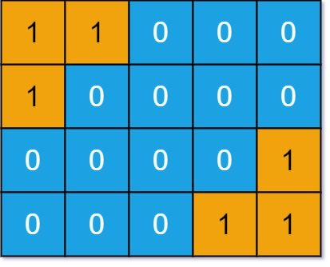
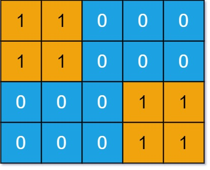

# 711 不同島嶼數量II

給定一個 m x n 二進制數組表示的網格 grid ，一個島嶼由 四連通 （上、下、左、右四個方向）的 1 組成（代表陸地）。你可以認為網格的四周被海水包圍。

如果兩個島嶼的形狀相同，或者通過旋轉（順時針旋轉 90°，180°，270°）、翻轉（左右翻轉、上下翻轉）後形狀相同，那麽就認為這兩個島嶼是相同的。

返回 這個網格中形狀 不同 的島嶼的數量 。


##  Number of Distinct Islands II

You are given an m x n binary matrix grid. An island is a group of 1's (representing land) connected 4-directionally (horizontal or vertical.) You may assume all four edges of the grid are surrounded by water.

An island is considered to be the same as another if they have the same shape, or have the same shape after rotation (90, 180, or 270 degrees only) or reflection (left/right direction or up/down direction).

Return the number of distinct islands.

[LeetCode](https://leetcode-cn.com/problems/number-of-distinct-islands-ii/)

### Example 1



```
Input: grid = [[1,1,0,0,0],[1,0,0,0,0],[0,0,0,0,1],[0,0,0,1,1]]
Output: 1
Explanation: The two islands are considered the same because if we make a 180 degrees clockwise rotation on the first island, then two islands will have the same shapes.
```

### Example 2



```
Input: grid = [[1,1,0,0,0],[1,1,0,0,0],[0,0,0,1,1],[0,0,0,1,1]]
Output: 1
```

### Constraints

* m == grid.length
* n == grid[i].length
* 1 <= m, n <= 50
* grid[i][j] is either 0 or 1.


### C++ 

```
class Solution {
private:
    const int moves[4][2] {{-1,0}, {1,0},{0,-1}, {0,1}}; //up, down, left, right
    vector<pair<int,int>> process(vector<pair<int,int>> path, int& sumX, int& sumY)const{
        vector<pair<int, int>> ret;
        int&& len = path.size();
        for(int i = 0; i < len; ++i)
        {
            int&& tempX = abs(sumX - path[i].first * len);
            int&& tempY = abs(sumY - path[i].second * len);

            if(tempX > tempY)
                swap(tempX, tempY);
            
            ret.emplace_back(tempX, tempY);
        }
         sort(ret.begin(), ret.end());

         return ret;        
    }
public:
    int numDistinctIslands2(vector<vector<int>>& grid) {
        /*
            旋轉90度會讓座標由 x,y變成 y, -x, 180度變成-x,-y, 270度變成 -y, x
            對x軸翻轉會變成 x, -y, 對y軸翻轉變成 -x, y
            要處理平移問題，可藉由每一個點與最左上角的點間的相對位置來處理
            要理理旋轉翻轉問題，就要將座間間的相對資訊處理成不受正負號影響
        */

        int&& rowNum = grid.size();
        int&& colNum = grid[0].size();
        set<vector<pair<int,int>>> islands;

        //遍曆這個grid，找出某片陸地的最左上角的點
        vector<pair<int,int>> path;
        for(int row = 0; row < rowNum; ++row)
        {
            for(int col = 0; col < colNum; ++col)
            {
                if(grid[row][col] == 0)
                    continue;
                
                queue<pair<int, int>> frontier;
                grid[row][col] = 0;       //將這個點設為0，用來代表已經走過這一個點
                frontier.emplace(row, col);
                path.clear();

                int sumX = 0;
                int sumY = 0;

                while(frontier.empty() != true)
                {   
                    pair<int,int> curr = frontier.front();
                    path.emplace_back(curr);      //紀錄路徑
                    frontier.pop();
                    sumX += curr.first;
                    sumY += curr.second;

                    for(int i = 0; i < 4; ++i)
                    {
                        int&& nextRow = curr.first + moves[i][0];
                        int&& nextCol = curr.second + moves[i][1];
                        if(nextRow >= 0 && nextRow < rowNum && nextCol >=0 && nextCol < colNum && grid[nextRow][nextCol] == 1)
                        {
                            grid[nextRow][nextCol] = 0;
                            frontier.emplace(nextRow, nextCol);
                        }
                    }

                }
                //將這個島的資訊處理成無關旋轉翻轉
                islands.insert(process(path, sumX, sumY));
            }
        }

        return islands.size();
    }
};
```
